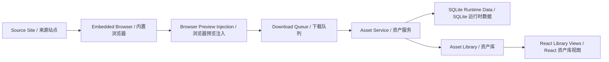
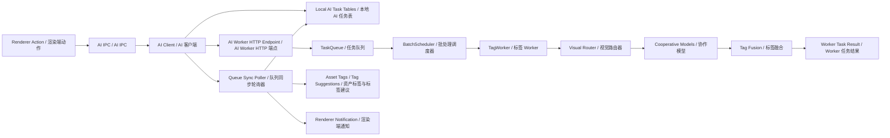
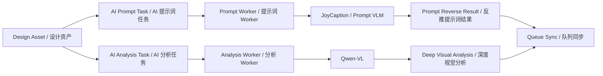
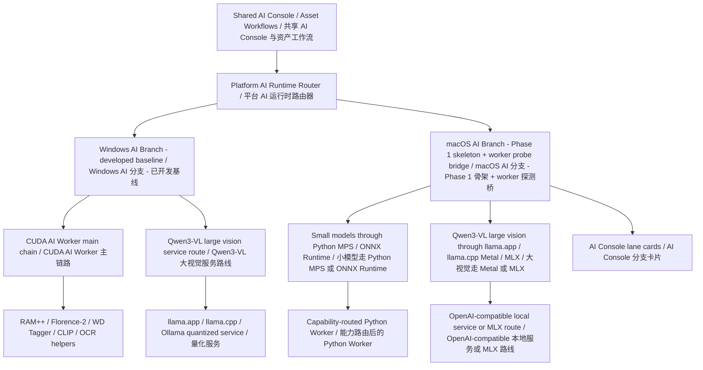
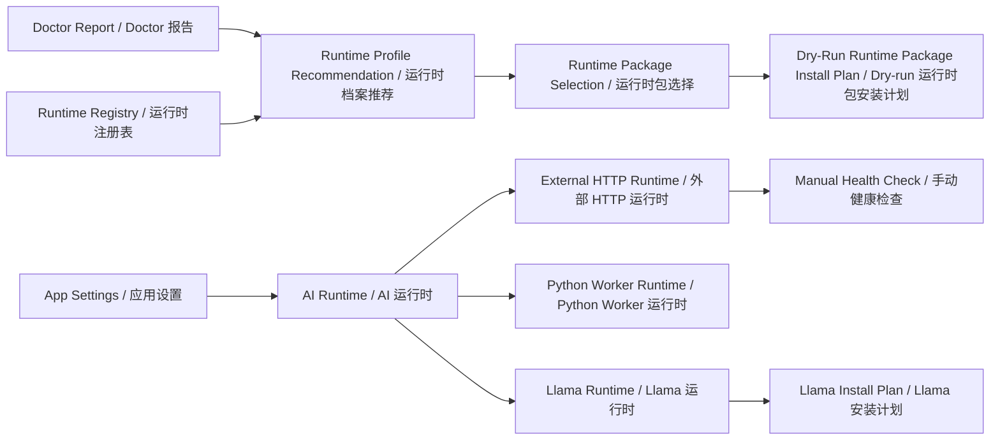

# 架构思维导图 / Architecture Mind Map

本文档以中英文双语梳理 Design Asset Manager 的软件架构、主要技术、AI 模型、运行时系统、分支相关变化和治理边界。

This bilingual document maps the software architecture, major technologies, AI models, runtime systems, branch-relevant changes, and governance boundaries for Design Asset Manager.

本文档只用于描述架构和术语，不授权启动运行时服务、下载模型、迁移路径、执行安装器或检查用户私有数据。

This document is descriptive only. It does not authorize runtime service launches, model downloads, path migrations, installer execution, or user data inspection.

## 分支快照 / Branch Snapshot

当前本地仓库暴露以下分支。

The local repository currently exposes these branches.

| 分支 / Branch | 在本图中的角色 / Role in this map | 关键架构语言 / Notable architecture language |
| --- | --- | --- |
| `main` | 当前集成基线 / Current integrated baseline | Doctor repair, macOS Llama hardware detection, native dependency packaging, cross-platform runtime governance, AI Console runtime management. |
| `feature/macos-adjustments` | 较早的 macOS 调整分支 / Earlier macOS adjustment branch | AI Runtime panel placement, localized Doctor panel, sharp macOS optional package handling, macOS validation stabilization. |

`main` 包含比 `feature/macos-adjustments` 更新的提交，因此本图以 `main` 为权威基线，并把 feature 分支作为 macOS 相关术语的历史信号。

`main` contains newer commits beyond `feature/macos-adjustments`, so this map treats `main` as authoritative and uses the feature branch as historical signal for macOS-specific terminology.

## 思维导图 / Mind Map

```mermaid
mindmap
  root(("Design Asset Manager / 设计资产管理器"))
    Product Domains / 产品域
      Asset Library / 资产库
        Design Asset / 设计资产
        Asset Source / 资产来源
        Source Site / 来源站点
        Embedded Browser / 内置浏览器
        Download Queue / 下载队列
        Thumbnail / 缩略图
        Normalized Image / 归一化图像
        Asset Inspector / 资产检查器
      Tags / 标签
        Tag / 标签
        Asset Tag / 资产标签
        Tag Suggestion / 标签建议
        Tag Alias / 标签别名
        Tag Relation / 标签关系
        Tag Group / 标签组
        Tag Fusion / 标签融合
        Tag Localization / 标签本地化
      Visual Analysis / 视觉分析
        Color Palette / 色板
        Dominant Color / 主色
        Text Box / 文本框
        Text Color Analysis / 文本颜色分析
        OCR Text / OCR 文本
        Readability Score / 可读性评分
    Desktop Architecture / 桌面软件架构
      Electron Main / Electron 主进程
        App Windows / 应用窗口
        IPC Handlers / IPC 处理器
        Services / 服务
        SQLite
        Browser Capture / 浏览器捕获
        Doctor / 诊断器
        Runtime Governance / 运行时治理
      Preload Bridge / 预加载桥
        electronAPI
        browserAPI
        Contract Boundary / 契约边界
      React Renderer / React 渲染进程
        Routes / 路由
        Components / 组件
        Zustand Stores / Zustand 状态
        AI Console / AI 控制台
        Settings / 设置
        Library Views / 资产库视图
      Shared Contracts / 共享契约
        Types / 类型
        Constants / 常量
        IPC Channels / IPC 通道
    AI Architecture / AI 架构
      Platform AI Branches / 平台 AI 分支
        Windows AI Branch / Windows AI 分支
        macOS AI Branch / macOS AI 分支
      AI Client / AI 客户端
        Queue Writes / 队列写入
        HTTP Calls / HTTP 调用
        Background Poller / 后台轮询器
        Renderer Notifications / 渲染端通知
      Python AI Worker / Python AI Worker
        FastAPI
        TaskQueue / 任务队列
        BatchScheduler / 批处理调度器
        ModelManager / 模型管理器
        TagWorker / 标签 Worker
        PromptWorker / 提示词 Worker
        AnalysisWorker / 分析 Worker
      Model Routing / 模型路由
        VisualRouter / 视觉路由器
        FlorenceSemanticRouter / Florence 语义路由
        Cooperative Tagging Pipeline / 协作打标流水线
        Routing Preview / 路由预览
      Model Families / 模型家族
        RAM++
        Florence-2
        WD Tagger
        CLIP Design Classifier / CLIP 设计分类器
        CLIP/SigLIP ONNX
        JoyCaption
        Qwen-VL
        Qwen3-VL
      Compatibility Checkers / 兼容性检查器
        Python MPS Compatibility Checker / Python MPS 兼容性检查器
        CLIP/SigLIP ONNX Compatibility Checker / CLIP/SigLIP ONNX 兼容性检查器
        Qwen3-VL Compatibility Checker / Qwen3-VL 兼容性检查器
      Inference Outputs / 推理输出
        AI Tags / AI 标签
        Captions / 描述文本
        Prompt Reverse Result / 反推提示词结果
        Deep Visual Analysis / 深度视觉分析
    Runtime Systems / 运行时系统
      AI Runtime / AI 运行时
        Active Runtime / 当前运行时
        Runtime Provider / 运行时 Provider
        Python Worker Runtime / Python Worker 运行时
        External HTTP Runtime / 外部 HTTP 运行时
        Manual Health Check / 手动健康检查
      Platform Runtime Split / 平台运行时拆分
        Windows CUDA
        Python MPS
        ONNX Runtime
        llama.cpp Metal
        MLX
      External Inference / 外部推理
        Ollama
        LM Studio
        llama.app
        Custom HTTP / 自定义 HTTP
      Llama Runtime / Llama 运行时
        Hardware Profile / 硬件档案
        Accelerator / 加速器
        Install Plan / 安装计划
        GGUF Model / GGUF 模型
        MMProj Model / MMProj 模型
        Server Test / 服务测试
      Bootstrap / 启动治理
        Runtime Profile / 运行时档案
        Runtime Registry / 运行时注册表
        Runtime Package Manifest / 运行时包清单
        Runtime Package Selection / 运行时包选择
        Runtime Package Install Plan / 运行时包安装计划
    Governance / 治理
      Path Governance / 路径治理
        Managed Paths / 托管路径
        User Roots / 用户根目录
        Path Root ID / 路径根 ID
        Library-Relative Path / 资产库相对路径
        Legacy Absolute Path / 旧绝对路径
        Dry Run / 预演
        Backup / 备份
        Rollback / 回滚
        Explicit Confirmation / 显式确认
      Doctor / 诊断器
        Platform Checks / 平台检查
        Python Checks / Python 检查
        Node Checks / Node 检查
        Native Dependency Checks / 原生依赖检查
        AI Worker Checks / AI Worker 检查
        Port Checks / 端口检查
        Managed Path Checks / 托管路径检查
        Bounded Repair / 有界修复
      Packaging / 打包
        electron-vite
        electron-builder
        NSIS
        DMG
        asar
        asarUnpack
        extraResources
        Package Smoke / 包冒烟测试
        Sandbox Install Smoke / 沙箱安装冒烟测试
      CI / 持续集成
        Governance Workflow / 治理工作流
        Runtime Safety Tests / 运行时安全测试
        Hygiene Checks / 卫生检查
        Validation Only / 仅验证
```

## 架构层 / Architecture Layers

| 层 / Layer | 归属 / Ownership | 主要职责 / Main responsibilities | 边界说明 / Boundary notes |
| --- | --- | --- | --- |
| Electron 主进程 / Electron main process | `src/main/` | 应用启动、窗口、IPC 注册、SQLite-backed services、浏览器捕获、Doctor、AI Client、运行时治理。 / App bootstrap, windows, IPC registration, SQLite-backed services, browser capture, Doctor, AI client, runtime governance. | 不直接运行模型推理；公共 IPC 名称是契约边界。 / Does not run model inference directly. Public IPC names are contract boundaries. |
| 预加载桥 / Preload bridge | `src/preload/` | 通过 `electronAPI` 和 `browserAPI` 暴露安全渲染端 API。 / Exposes safe renderer APIs through `electronAPI` and `browserAPI`. | 避免渲染进程直接接触原始 Node/Electron API。 / Keeps renderer away from raw Node/Electron APIs. |
| React 渲染进程 / React renderer | `src/renderer/` | 资产库浏览、设置、AI Console、资产检查、标签工作流、下载 UI、状态存储。 / Library browsing, settings, AI Console, asset inspection, tag workflows, download UI, state stores. | 通过 preload API 调用主进程能力。 / Uses preload APIs rather than direct main-process services. |
| 共享契约 / Shared contracts | `src/shared/` | 共享 TypeScript 类型、常量、IPC 请求/响应契约。 / Shared TypeScript types, constants, IPC request/response contracts. | 契约名称和响应形状是公开应用边界。 / Contract names and response shapes are public app boundaries. |
| SQLite 运行时数据 / SQLite runtime data | `src/main/db/` | 存储站点、资产、标签、资产标签关系、标签建议、AI 任务、提示词任务、分析任务和下载任务。 / Stores sites, assets, tags, asset-tag relations, tag suggestions, AI tasks, prompt tasks, analysis tasks, and download tasks. | 运行时数据库内容是用户私有数据，默认不检查。 / Runtime database contents are private user data and are not inspected by default. |
| Python AI Worker / Python AI Worker | `ai-service/` | FastAPI 任务端点、队列、批处理、模型管理、打标、反推提示词、分析、OCR helper、翻译。 / FastAPI task endpoints, queue, batching, model management, tagging, prompt reverse, analysis, OCR helpers, translation. | Worker API 形状是公共集成边界。 / Worker API shapes are public integration boundaries. |
| 平台治理 / Platform governance | `src/main/platform/`, `src/main/path-migration/`, `docs/platform/` | 托管路径、日志/缓存/临时目录安全、dry-run 路径计划、设置迁移、运行时包计划。 / Managed paths, log/cache/temp safety, dry-run path plans, settings migration, runtime package planning. | 计划优先；不自动迁移或下载。 / Planning-first; no automatic migrations or downloads. |

## 数据与控制流 / Data And Control Flow

### 资产捕获与资产库流程 / Asset Capture And Library Flow

捕获路径从内置浏览器开始，记录计划下载，持久化资产元数据，并通过 React UI 渲染资产库状态。资产文件和路径都按用户私有数据处理。

The capture path starts in the embedded browser, records planned downloads, persists asset metadata, and renders library state through the React UI. Asset files and paths are treated as user-private data.

### 打标与 AI 同步流程 / Tagging And AI Sync Flow

应用故意使用 Electron 侧轮询器同步 Worker 结果，而不是依赖 Worker push callback。这样可以保持本地 SQLite 写入由 Electron 统一负责。

The app deliberately uses an Electron-side poller to synchronize worker results instead of relying on worker push callbacks. This keeps local SQLite writes owned by Electron.

### 反推提示词与分析流程 / Prompt Reverse And Analysis Flow

反推提示词产出可复用的提示词语言和设计描述符。深度视觉分析产出标签之外的结构化设计解读。

Prompt reverse produces reusable prompt language and design descriptors. Deep visual analysis produces structured design interpretation beyond tags.

### Windows / macOS AI 分支流程 / Windows / macOS AI Branch Flow

 Windows 和 macOS 共享产品工作流、结果 schema、IPC surface、设置概念和 Electron-owned queue sync。它们不应该共享一个单体模型执行假设：CUDA VRAM policy 是 Windows-specific，而 macOS 需要 MPS、ONNX、Metal 和 MLX-specific capability routing。当前已把 macOS AI branch lanes 作为只读 runtime metadata 接入 AI Console，并通过 worker capability probe bridge 读取实时 MPS / ONNX / MLX 以及 RAM++、Florence-2、CLIP/SigLIP、WD14、RapidOCR、PaddleOCR 的家族级探测结果；AI Console 里也增加了 macOS route overview；模型下载和真实推理验证仍在后续阶段。

 Windows and macOS share product workflows, result schemas, IPC surfaces, settings concepts, and Electron-owned queue sync. They should not share one monolithic model-execution assumption: CUDA VRAM policy is Windows-specific, while macOS needs MPS, ONNX, Metal, and MLX-specific capability routing. Phase 1 now exposes macOS AI branch lanes as read-only runtime metadata in AI Console; Worker probes now also surface family-level availability for RAM++, Florence-2, CLIP/SigLIP, WD14, RapidOCR, and PaddleOCR; model downloads and real inference validation remain later phases.

### 运行时治理流程 / Runtime Governance Flow

运行时治理是 plan-first。远程源、运行时包下载、真实进程启动和外部端点检查都保持 disabled 或 user-triggered，除非由明确 UI 操作触发。

Runtime governance is plan-first. Remote sources, runtime package downloads, real process launches, and external endpoint checks stay disabled or user-triggered unless a specific UI action invokes them.

## 技术图谱 / Technology Map

| 领域 / Area | 技术 / Technology | 用途 / Purpose |
| --- | --- | --- |
| 桌面壳 / Desktop shell | Electron | 原生桌面应用容器、主进程、窗口、IPC、打包。 / Native desktop app container, main process, windows, IPC, packaging. |
| 主构建 / Main build | electron-vite, Vite, TypeScript | 构建 main、preload 和 renderer bundles。 / Builds main, preload, and renderer bundles. |
| 渲染端 / Renderer | React, React Router, Zustand, Tailwind CSS, lucide-react | UI 路由、本地状态、样式、图标。 / UI routes, local state, styling, icons. |
| 本地数据库 / Local database | SQLite through `better-sqlite3` | 资产、标签、任务、下载和站点元数据。 / Asset, tag, task, download, and site metadata. |
| 图像处理 / Image processing | `sharp`, ColorThief | 图像归一化、缩略图/媒体处理、色板提取。 / Image normalization, thumbnail/media handling, palette extraction. |
| 浏览器捕获 / Browser capture | Electron browser view, Playwright support | 来源浏览、预览注入、捕获/下载工作流。 / Source browsing, preview injection, capture/download workflows. |
| AI Worker / AI Worker | Python, FastAPI, Uvicorn | 本地 AI 任务服务和 Worker 编排。 / Local AI task server and worker orchestration. |
| AI 模型 / AI models | RAM++, Florence-2, WD Tagger, CLIP, CLIP/SigLIP ONNX, JoyCaption, Qwen-VL/Qwen3-VL | 打标、caption、反推提示词、路由、视觉分析。 / Tagging, captioning, prompt reverse, routing, visual analysis. |
| 兼容性检查器 / Compatibility checkers | Python MPS Compatibility Checker, CLIP/SigLIP ONNX Compatibility Checker, Qwen3-VL Compatibility Checker | 在下载或运行前验证本地模型文件夹、依赖和 graph 形状，避免把占位状态误当成可运行状态。 / Verify local model folders, dependencies, and graph shape before download or run so placeholder states are not mistaken for runnable ones. |
| Windows AI 分支 / Windows AI branch | CUDA AI Worker, llama.app / llama.cpp / Ollama quantized service | 保留现有 CUDA AI Worker 主链路；Qwen3-VL 大视觉推理迁移到量化服务后端。 / Keep existing CUDA AI Worker main chain; move Qwen3-VL large visual inference to quantized service backends. |
| macOS AI 分支 / macOS AI branch | Python MPS, ONNX Runtime, llama.app / llama.cpp Metal, MLX, Ollama fallback, external HTTP fallback | Phase 1 skeleton 已接入 AI Console，且 worker probe bridge 读取实时 MPS / ONNX / MLX 以及 RAM++、Florence-2、CLIP/SigLIP、CLIP/SigLIP ONNX、WD14、RapidOCR、PaddleOCR 的家族级能力；Python MPS compatibility checker 让 MPS 路线可独立验证；小模型走 Python/ONNX，大型 Qwen3-VL 视觉模型走 Metal/MLX-capable services. / Phase 1 skeleton is connected to AI Console, and the worker probe bridge reads live MPS / ONNX / MLX plus family-level RAM++、Florence-2、CLIP/SigLIP、CLIP/SigLIP ONNX、WD14、RapidOCR、PaddleOCR capability data; the Python MPS compatibility checker makes the MPS route independently probeable; small models use Python/ONNX, large Qwen3-VL visual models use Metal/MLX-capable services. |
| macOS AI 路线概览 / macOS AI route overview | MPS, ONNX Runtime, MLX, Llama route priority, Ollama fallback, external HTTP fallback | AI Console 总览里展示 macOS 路线优先级、就绪状态、Ollama fallback 和 external HTTP fallback 配置/健康摘要，帮助区分可用、已配置与规划中能力。 / The AI Console overview displays macOS route priority, readiness, Ollama fallback, and external HTTP fallback configuration/health summaries so available, configured, and planned capabilities stay visually separated. |
| OCR/文本 / OCR/text | EasyOCR, RapidOCR, Qwen-VL text blocks, mock/none providers | 文本框、OCR 文本、文本颜色/可读性分析。 / Text boxes, OCR text, text color/readability analysis. |
| 本地推理运行时 / Local inference runtime | llama.cpp, llama.app, GGUF, MMProj | 本地 Llama-style multimodal inference planning and service control。 / Local Llama-style multimodal inference planning and service control. |
| 外部推理 / External inference | Ollama, LM Studio, custom OpenAI-compatible HTTP | 用户配置的推理端点。 / User-configured inference endpoints. |
| 打包 / Packaging | electron-builder, NSIS, DMG, asar, asarUnpack, extraResources | Windows/macOS 打包和资源包含。 / Windows/macOS packaging and resource inclusion. |
| CI/治理 / CI/governance | GitHub Actions, static tests, Doctor CI wrapper | 不下载模型或发布产物的跨平台验证。 / Cross-platform validation without model downloads or release publishing. |

## AI 模型与来源图谱 / AI Model And Source Map

| 模型/来源 / Model/source | 规范来源语言 / Canonical source language | 主要角色 / Main role | 说明 / Notes |
| --- | --- | --- | --- |
| RAM++ | `ai_ram`, `ai_ram_plus` | 通用视觉与多标签打标。 / General visual and multi-label tagging. | 用于 broad photo/product/illustration/design signals。 / Used for broad photo/product/illustration/design signals. |
| Florence-2 | `ai_florence`, `ai_florence_semantic` | Captioning、详细 caption、设计语义路由。 / Captioning, detailed captioning, design semantic routing. | 帮助细化 design/UI/document routing。 / Helps refine design/UI/document routing. |
| WD Tagger | `ai_wd_tagger` | 动漫和插画特征提取。 / Anime and illustration feature extraction. | 面向 anime-like assets。 / Specialized for anime-like assets. |
| CLIP Design Classifier / CLIP 设计分类器 | `ai_clip_design` | Zero-shot 或词典式设计分类。 / Zero-shot or dictionary-based design classification. | 将资产匹配到设计词汇。 / Matches assets against design vocabulary. |
| Design Rule / 设计规则 | `design_rule` | 规则派生的设计标签。 / Rule-derived design tags. | 使用产品特定启发式和词汇。 / Uses product-specific heuristics and vocabulary. |
| Metadata / 元数据 | `metadata` | 非模型元数据派生标签。 / Non-model metadata-derived tags. | 补充视觉推理。 / Complements visual inference. |
| Color Palette / 色板 | `color_palette` | 颜色派生标签和筛选。 / Color-derived tags and filters. | 来自色板提取。 / Comes from palette extraction. |
| Qwen-VL / Qwen3-VL | `ai_qwen_vl` | 深度视觉分析、反推提示词、文本框工作流。 / Deep visual analysis, prompt reverse, text block workflows. | 模型候选包含 size、quantization、hardware 和 vision support。 / Model candidates include size, quantization, hardware, and vision support. |
| JoyCaption | `ai_joycaption` | Prompt/caption generation。 / Prompt/caption generation. | 用于 Prompt Worker 术语和反推提示词 surface。 / Used by prompt worker terminology and prompt-reverse surfaces. |

## 运行时与打包边界 / Runtime And Packaging Boundaries

| 边界 / Boundary | 当前原则 / Current principle | 重要性 / Why it matters |
| --- | --- | --- |
| AI 推理位置 / AI inference location | 推理属于 Python AI Worker 或显式外部运行时，不属于 Electron main。 / Inference belongs in Python AI Worker or explicit external runtime, not Electron main. | 保护桌面响应性，并避免把模型依赖塞进主进程逻辑。 / Protects desktop responsiveness and keeps model dependencies out of main process logic. |
| 平台 AI 拆分 / Platform AI split | Windows 和 macOS 是共享工作流背后的独立 AI runtime branches。 / Windows and macOS are separate AI runtime branches behind shared workflows. | CUDA、MPS、ONNX、Metal、MLX 和量化服务行为不可互换。 / CUDA, MPS, ONNX, Metal, MLX, and quantized-service behavior are not interchangeable. |
| 结果同步 / Result sync | Electron owns local SQLite writes and polls worker results。 / Electron owns local SQLite writes and polls worker results. | 集中持久化，避免 Worker-side writes 进入 app database。 / Keeps persistence centralized and avoids worker-side writes into the app database. |
| 外部 HTTP / External HTTP | Health checks are manual/user-triggered。 / Health checks are manual/user-triggered. | 防止对用户配置端点发起意外网络调用。 / Prevents surprise network calls to user-configured endpoints. |
| 运行时包 / Runtime packages | source、download、verification、extraction、install、rollback 都先建模为 dry-run plans。 / Source, download, verification, extraction, install, and rollback are modeled as dry-run plans first. | 防止意外下载、写文件、改注册表或安装模型。 / Prevents accidental downloads, file writes, registry mutation, or model installs. |
| 路径迁移 / Path migration | Requires dry-run, backup, rollback, old-path fallback, and explicit confirmation。 / Requires dry-run, backup, rollback, old-path fallback, and explicit confirmation. | 避免 Windows/macOS 路径差异和用户资产库移动造成数据丢失。 / Avoids data loss across Windows/macOS path differences and user library moves. |
| 托管路径 / Managed paths | App-managed logs/cache/temp/runtime metadata are separate from user roots。 / App-managed logs/cache/temp/runtime metadata are separate from user roots. | 将生成的应用数据与用户资产/模型根目录分开。 / Keeps generated app data away from user asset/model roots. |
| 打包输出 / Packaging outputs | Windows NSIS 与 macOS DMG 受治理；签名、公证、发布和自动更新保留。 / Windows NSIS and macOS DMG are governed; signing, notarization, release publishing, and auto-update are reserved. | 在凭据和发布策略确定前保持分发显式。 / Keeps distribution explicit until credentials and release policy exist. |
| 原生依赖 / Native dependencies | `better-sqlite3`, `sharp`, and `@img` optional native packages must be unpacked from asar。 / Native packages must be unpacked from asar. | 防止 packaged app 因 native modules 或 libvips 被困在 `app.asar` 内而崩溃。 / Prevents packaged app crashes from native modules or libvips being trapped inside `app.asar`. |

## 公共契约面 / Public Contract Surfaces

| 契约面 / Surface | 示例 / Examples | 变更风险 / Change risk |
| --- | --- | --- |
| IPC 通道 / IPC channels | `assets:*`, `tag:*`, `ai:*`, `aiRuntime:*`, `llama-runtime:*`, `doctor:*`, `settingsMigration:*` | 重命名会破坏 preload 和 renderer callers。 / Renaming breaks preload and renderer callers. |
| AI Worker HTTP API | `/ai/tag/enqueue`, `/ai/prompt/generate`, `/ai/analysis/generate`, `/ai/model/status`, `/ai/routing/preview` | 形状变化会破坏 Electron AI Client 和任务同步。 / Shape changes break Electron AI client and task sync. |
| SQLite schema semantics / SQLite schema 语义 | assets, tags, asset_tags, tag_suggestions, AI task tables, download_tasks | 迁移错误会影响用户私有资产库状态。 / Migration mistakes can affect private user library state. |
| 设置形状 / Settings shape | `AppSettings`, runtime settings, prompt reverse settings, managed paths, bootstrap, doctor settings | 需要兼容已有 settings files。 / Backward compatibility matters for existing settings files. |
| 运行时包契约 / Runtime package contracts | source, manifest, selection, download plan, extract plan, install plan | 后续真实 installer work 依赖稳定 planning shapes。 / Later real installer work depends on stable planning shapes. |

## Windows / macOS 代码复用评估 / Windows / macOS Code Reuse Assessment

详细复用矩阵见 `docs/platform/AI_PLATFORM_BRANCH_REUSE_ASSESSMENT.md`。

The detailed reuse matrix lives in `docs/platform/AI_PLATFORM_BRANCH_REUSE_ASSESSMENT.md`.

| 类别 / Category | macOS 复用评估 / macOS reuse assessment |
| --- | --- |
| 可直接/基本复用 / Shared as-is or mostly shared | 产品 UI 工作流、共享契约、资产/标签/下载/搜索服务、SQLite data model、外部 HTTP provider、prompt templates/result schema、Doctor shell、managed path governance、packaging governance。 / Product UI workflows, shared contracts, asset/tag/download/search services, SQLite data model, external HTTP provider, prompt templates/result schema, Doctor shell, managed path governance, packaging governance. |
| 需要平台适配 / Reusable with platform adaptation | AI Console runtime cockpit、AI Runtime abstraction、runtime profiles、Llama runtime planner/install service、Python Worker queue/scheduler、小模型 wrappers、GPU/Memory monitor、OCR/text providers。 / AI Console runtime cockpit, AI Runtime abstraction, runtime profiles, Llama runtime planner/install service, Python Worker queue/scheduler, small model wrappers, GPU/Memory monitor, OCR/text providers. |
| macOS AI 不可直接复用 / Not directly reusable for macOS AI | Native Python Qwen3-VL large-model path、CUDA memory guard as universal policy、Windows-oriented Python discovery、Windows CUDA llama package assumptions、Windows Sandbox installer smoke assumptions。 / Native Python Qwen3-VL large-model path, CUDA memory guard as universal policy, Windows-oriented Python discovery, Windows CUDA llama package assumptions, Windows Sandbox installer smoke assumptions. |

## 文档交叉引用 / Documentation Cross-References

| 主题 / Topic | 主要文档 / Primary docs |
| --- | --- |
| 紧凑仓库图和边界 / Compact repo map and boundaries | `README.md`, `AGENTS.md`, `TASK.md` |
| 模块归属 / Module ownership | `src/main/README.md`, `src/renderer/README.md`, `src/shared/README.md`, `ai-service/README.md` |
| AI 模型和 Worker / AI model/workers | `ai-service/models/README.md`, `ai-service/core/README.md`, `ai-service/workers/README.md`, `ai-service/prompts/qwen3vl/README.md` |
| 运行时/包治理 / Runtime/package governance | `docs/platform/RUNTIME_PACKAGE_SOURCE.md`, `docs/platform/RUNTIME_PACKAGE_DOWNLOADER.md`, `docs/platform/RUNTIME_PACKAGE_VERIFIER_EXTRACTOR.md`, `docs/platform/RUNTIME_PACKAGE_INSTALLER.md` |
| 外部和 Python 运行时边界 / External and Python runtime boundaries | `docs/platform/EXTERNAL_HTTP_MANUAL_HEALTH_CHECK.md`, `docs/platform/PYTHON_WORKER_LAUNCH_PILOT.md`, `docs/platform/AI_CLIENT_RUNTIME_ADAPTER.md` |
| OCR 和 Llama 治理 / OCR and Llama governance | `docs/platform/OCR_DEPENDENCY_GOVERNANCE.md`, `docs/platform/LLAMA_RUNTIME_GOVERNANCE.md` |
| Windows/macOS AI 分支复用评估 / Windows/macOS AI branch reuse assessment | `docs/platform/AI_PLATFORM_BRANCH_REUSE_ASSESSMENT.md` |
| 路径治理 / Path governance | `docs/platform/PATH_FIELD_INVENTORY.md`, `docs/platform/PATH_GOVERNANCE_RISK_REGISTER.md`, `docs/platform/PATH_MIGRATION_DESIGN.md`, `docs/platform/DATABASE_PATH_DESIGN.md`, `docs/platform/DATABASE_PATH_MIGRATION_PLAN.md`, `docs/platform/ASSET_LIBRARY_PATH_GOVERNANCE.md`, `docs/platform/DOWNLOAD_PATH_GOVERNANCE.md`, `docs/platform/MEDIA_PATH_GOVERNANCE.md` |
| 打包和发布 / Packaging and release | `docs/platform/ELECTRON_PACKAGING_AUDIT.md`, `docs/platform/NATIVE_DEPENDENCY_PACKAGING.md`, `docs/platform/PACKAGE_SMOKE_TOOL.md`, `docs/platform/RELEASE_FLOW_GOVERNANCE.md` |
