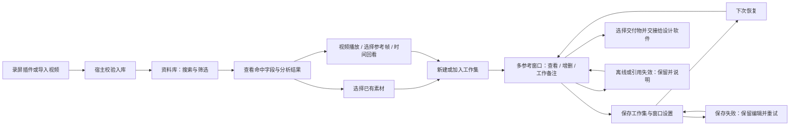

# 核心体验：Gallery & Glass

当前界面已按[极简画布修订](MINIMAL-CANVAS-20260914.md)更新；下文宽侧栏和初版截图
保留历史验证背景，不作为当前导航规范。

2026-09-14。本轮交付为设计规范、流程图、隔离交互原型和技术验证清单。
不替代正式应用、真实模型或原生窗口/跨应用验证。真实素材库验证继续暂停。

## 设计依据与规范入口

- [mobbin.md](../../mobbin.md)：当前视觉token、组件、明暗主题、玻璃/渐变与回退规则。
- [用户参考原文](references/DESIGN-mobbin.source.md)：完整保留，只作为分析资料。
- [Google DESIGN.md介绍](https://github.com/google-labs-code/design.md)及[格式](https://github.com/google-labs-code/design.md/blob/main/docs/spec.md)：使用YAML token和说明正文，而非只写风格形容词。
- [Apple Liquid Glass](https://developer.apple.com/videos/play/wwdc2025/219/)：参考导航/控制层独立于内容的层级；本原型用CSS材料表达，不声称原生折射。

保留Mobbin内容优先、中性底色、圆润控件；调整其禁止渐变/阴影、商用Saans字体、
营销蓝和巨大标题规则。新的玻璃用于控制层，渐变用于工作环境；不改变素材颜色。
旧DESIGN已完整归档，根DESIGN只导航到新规范，旧UI文档明确为接线/历史背景。

## 核心流程图

流程图中原生交接、录屏入库与模型执行是后续目标；浏览器接收区只演示操作关系。
工作集移除不等于删除素材。资料库整理不进入工作窗口。下次恢复的是数据和布局，
不是云端授权或自动执行中的AI任务。

## 运行与交互范围

仓库根执行：`npm run prototype:work-mode`，打开终端输出的本机地址。
可用`DAM_PROTOTYPE_PORT`指定空闲端口。预览使用独立临时Vite入口，不启动正式App、
Electron、数据库、外部AI或网页采集。停止对应终端进程即可关闭预览服务。

原型代码位于[src/renderer/routes/work-mode-prototype](../../src/renderer/routes/work-mode-prototype/README.md)。
8份原创合成设计与1段5秒合成视频在本地使用，无用户素材、竞品截图或远程图片依赖。
启动器读取mobbin.md的颜色/圆角token；正文中的间距、材料与字号映射到隔离CSS。

| 编号 | 交互 | 原型表现和界限 |
| --- | --- | --- |
| UX-01 | 搜索与筛选 | 名称、预置标签、描述与提示词可匹配，说明字段；没有向量检索或AI推理 |
| UX-02 | 无结果与失败 | 清除查询/筛选；演示读取失败后重试，区别于零匹配 |
| UX-03 | 查看参考 | 单击检查器、双击/按钮专注查看；颜色比例与反推明确标注预置演示 |
| UX-04 | 多选与加入工作集 | 显式复选，新建必须命名，也可加入已有集合；追加不重复成员 |
| UX-05 | 多工作窗口 | 初始双面板，标题栏拖动、尺寸调整、模拟置顶、隐藏及找回；浏览器内模拟 |
| UX-06 | 工作备注与成员移除 | 备注属于工作集；移除仅解除引用，资料库仍有原样例 |
| UX-07 | 保存与恢复 | 显式保存到原型专用localStorage，刷新恢复工作集/备注/窗口配置；无数据库写入 |
| UX-08 | 保存失败 | 故障开关阻止保存，旧保存内容不变，当前编辑保留，可重试 |
| UX-09 | 交接 | 可拖到浏览器接收区或用“演示交接”按钮；接收引用，不传输原生文件 |
| UX-10 | 视频参考 | 真实本地合成视频播放/定位，多时间点选帧、移除记录、点击回看；不生成独立帧图片 |
| UX-11 | 离线与模型缺失 | 单素材离线保留引用，模型未就绪时不阻塞库浏览；无真实设备/模型探测 |
| UX-12 | 外观与辅助功能 | 明暗、实色材料、减少动态效果、显式按钮名称、模态Escape与焦点恢复 |
| UX-13 | 检查当前状态 | 演示设置列出当前查询、选择、集合、窗口、未保存状态和模拟接收引用 |

保存键为`dam-work-mode-prototype-v1`。保存的是合成样例ID、窗口/备注/参考时间点及
外观偏好，不保存真实素材、凭据或模型输入。更换预览端口属于不同浏览器origin，
不会自动迁移；“重置原型样例”仅清除此键。首次载入的样例不是用户已保存数据。
工作窗口的视频参考时间点随集合保存；检查器中的临时选帧只作交互草稿，未接入宿主媒体记录。

## 技术验证清单

| 项目 | 具体要证明什么 | 本轮证据 / 后续边界 |
| --- | --- | --- |
| 窗口与工作集分离 | 独立ID、成员、布局、备注与展示状态，不复制原件 | 原型状态模型；正式持久schema/IPC未改 |
| 原生多窗口 | 各自发起受限调用，置顶/焦点不干扰设计应用，切库统一撤销 | 待隔离Electron验证，CSS窗口不能代替 |
| 保存恢复 | 原子写入、失败不丢编辑、版本兼容、重启后不复用旧token | 原型localStorage保存/刷新；正式事务与进程重启待验证 |
| 跨显示器 | 拔屏、分辨率/缩放变化、全屏Space及窗口离屏可恢复 | 浏览器视口夹取只是原型；真实OS/显示器待验证 |
| 文件交接 | 原件副本/兼容物身份正确、接收方迟读、取消清理、安全Copy | 仅模拟引用交接；需选定实际接收应用和格式后测原生拖出 |
| 本地AI | 代表图片集下标签/描述/提示词质量、内存、耗时与错误 | 预置结果只验证UI；先列设备预算、模型许可和评测计划，再实施授权模型测试 |
| 搜索收益 | 字段解释、结构化颜色条件、不同模型空间与查询质量 | 原型字段匹配；当前正式词法通道与未来颜色/向量能力分开验证 |
| 视频 | 可用格式/解码、暂停恢复、实际展示时间、多窗口资源预算 | 本地5秒样片；任意用户视频/平台解码待验证 |
| 参考帧持久化 | 来源版本、实际时间、记录保留、独立图片的派生关系 | 原型时间点；未交付帧图片提取、版本追踪或宿主关系表 |
| 录屏插件 | 屏幕/窗口/区域及音轨授权、中断文件校验、卸载后数据保留 | 本轮未录屏或开发插件；先围绕明确采集契约评审 |
| 无障碍与材料 | 键盘完整、对比、减少动效/透明度、清晰素材显示 | 浏览器检查；OS偏好传播与原生焦点/屏幕阅读器待验证 |
| 性能 | 大量素材、多窗口/视频时的内存、响应与电量 | 8份样例不能证明规模性能；不能在UI确定前填虚假容量承诺 |

下一次正式实现优先围绕工作集/窗口和分析→搜索→复用的真实用户结果选择范围，
列出会改变的公共契约及验收。云端开发服务、MCP和社区市场继续暂缓。

## 本轮验证记录

- 16项合成交互检查通过：字段匹配/清空、多选建集、双面板拖动与键盘缩放、保存刷新恢复、
  成员移除、模拟交接、实际合成视频时间定位、保存失败保留编辑、隐藏恢复、离线/读取失败、
  模型缺失、明暗/实色、减少动效、1440×960/1024×768/390×844无横向溢出及模态退出。
- 额外验证首次样例显示未保存，明确保存后刷新显示已保存，避免样例冒充用户保存记录。
- 页面异常0、外部网络请求0。浅色、深色、工作面板、窄窗截图已目检；390px仅用于顺序预览。
- YAML解析、8个规定正文分区和22处token引用通过本地检查；未安装或运行Google CLI。
  六组实色文字对比约5.49–16.07:1（深色主按钮8.39:1）；透明背景仍按最终画面检验。
- typecheck、context:check、268条上下文路由评估、docs-sync和差异空白检查通过。
- 586个本轮开始前的运行代码/样式文件SHA保持，原暂存patch不变；附件副本与用户原文件、
  旧DESIGN归档与开始前内容逐字节/文本一致。只新增隔离原型/运行检查脚本及文档，不接入正式App。
- 完整交互报告位于临时证据目录`dam-work-mode-qa-kzfLkv`；对应源码检查脚本可重复执行。
  本轮恢复点目录名为`dam-mobbin-prototype-wdg3syni`。未提交或暂存内容。

可查看[资料库截图](artifacts/gallery-glass-20260914/library.png)、
[工作模式截图](artifacts/gallery-glass-20260914/work-mode.png)和
[深色工作模式](artifacts/gallery-glass-20260914/work-mode-dark.png)。

本轮不把浏览器测试写成原生窗口、真实AI或真实库验收。

## 素材整理、AI文件夹与色板修订（2026-09-14）

依据用户两张截图和四项修改要求，当前原型更新如下；前文截图保留初版证据。

- 左栏改为全部、未分类、未标签、最近使用、随机浏览、标签管理、色板、回收站；
  下方分组为AI文件夹、可展开普通文件夹树和创作参考。以整理为主，保留工作集和工作模式。
- AI文件夹只匹配已执行标签分析的样例，按标签条件动态引用；未分析素材不会混入。
  一份素材可命中多个视图，不复制文件、不改变普通文件夹。建议状态与用户确认不同。
- 色板左键复制HEX，右键/Shift+F10菜单提供复制、选择/新建色板文件夹、添加到指定工作窗口。
  同一收藏位置同值去重；颜色收藏不改变原图，不把调色板作为新文件导入。
- 工作窗口增加位于备注上方的色板；移除工作颜色不影响全局收藏。窗口颜色随工作集显式保存，
  全局色板单独保存于原型键`dam-palette-prototype-v1`，保留旧工作集存储兼容。
- 聚焦工作窗口素材后空格预览，Escape返回并恢复焦点；输入备注的空格不被拦截。
- 检查器配色紧接预览，移除重复素材标题，格式信息和分析内容保持。

差异化在于分析依据、手动组织/动态分类/工作集的明确分工，以及颜色到创作场景的直接复用；
参考通用文件树框架，不复制竞品图标、文字版式或把相同布局视为独占能力。
“资源社区”继续是未交付方向；标签管理页当前提供标签依据与筛选，不伪装已接入编辑。

后续可考虑：AI分类支持排除误分素材与显示命中理由；色板保存来源素材/取色位置；
空格预览增加左右键切换。它们是建议，本轮未扩展正式schema或后台功能。

本次9项聚焦检查及原16项交互回归通过，类型检查通过。剪贴板测试用合成适配器核对HEX调用，
不宣称系统剪贴板跨应用验收。AI文件夹测试覆盖未分析素材排除与多视图不增素材数；色板测试
覆盖右键/键盘菜单、选定/创建文件夹、重复收藏去重、添加工作色和刷新恢复；空格测试覆盖
焦点回归及备注输入不被截获。页面错误0，1024/390px无横向溢出。截图已目检：
[整理左栏](artifacts/ai-folder-palette-20260914/organization-library.png)、
[颜色菜单](artifacts/ai-folder-palette-20260914/color-menu.png)、
[工作窗口色板](artifacts/ai-folder-palette-20260914/window-palette.png)。
