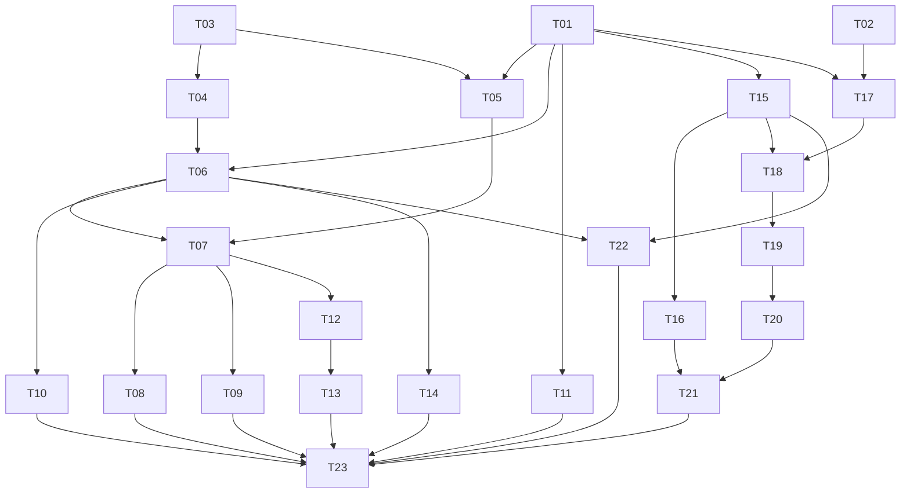

# 本地AI模型、资源、分析与混合检索：任务拆分草案

2026-10-07最新：用户将桌面验证转Browser并要求重合去重。本轮正式4deb/759完成取消/工作集/顶栏修复、索引恢复、双语以图、120分页、真实8B与生产后台、正常保存重开；原Chrome页压力工具阻碍、不可替代Native未验证，T23/父级未关闭。保护核对单列损坏副本暂停期间已有Luna/OCR审计差异，主库/人工/原件保持。详见[本轮浏览器交付](../../handoff/LOCAL-AI-T23-BROWSER-20261007.md)；以下旧限定/候选按历史范围保留，不重新形成队列。

2026-10-07最新限定：用户要求连续推进五项无界面收尾，当前a97d正式构建与70个相关TS/TSX文件、160项Python回归通过；数据保护、质量/性能对照和两轴审查整改已完成，交付采用精确任务补丁检查点并保持重叠旧WIP/原暂存。当前UI/原生/压力/索引故障与规模联合验收仍未运行，T23和父级不得关闭。见[无界面交付](../../handoff/LOCAL-AI-NON-UI-CLOSURE-20261007.md)，其版本/范围优先于下面15:23记录。

2026-10-06 拆分；2026-10-07 实施续接。来源：[规格 #24](https://github.com/zhr0210/design-asset-manager/issues/24)及[本地规格](../../product/LOCAL-AI-FOUNDATION-SPEC.md)。用户已明确调用 implement，授权在当前范围连续实施，无需逐切片确认；旧 Q18 不再阻止实施。23 张子 issue 尚未发布，发布审批与实施授权独立，父 issue 保持不变。

最新实施检查点（2026-10-07 15:23）：全部切片已有实施代码，正式用户联合验收继续，父级/T23未完成。模型目录、下载/恢复只用ModelScope境内源。22bc已完成8B CPU/混合/GPU实际素材及一键3/3、正常重开；4B混合实际描述、生产GGUF后台新公开素材和真实sent未知/明确新执行恢复均成立，OOM故障一次真实低方案已复验。冷加载取消相邻修复已先红后绿并构建565d，快速开库后状态仍待读回。原生CU被用户实体Escape停止，本轮界面操作按工具要求结束。新候选受影响路径、索引损坏/120分页、当前双语以图联合、指定Chrome压力、原生和最终完整检查/审查/安全提交仍待。详细连续状态见PROGRESS，旧候选不替代当前证据。

最新语言更正：语义检索须包含中文、英文、中英混合及跨素材描述/标签语言找回，已同步本地规格及T17/T18/T19/T21/T22/T23。父#24保留已发布快照，更正将写入相关子票。票数与34条阻塞边不变，此更正本身不视为发布批准。

共23个tracer-bullet切片。每项有完整正式入口、Host/实际执行或持久投影、可见结果及适用保存重开/失败保护；T01在可运行CPU/OCR路径内先做必要prefactoring。离线资格和目录没有人为加到T01后；4B/8B共享已验证运行基础，各自不互相阻塞。每项范围以一个fresh context为单位，长耗时模型/恢复测试保留可恢复检查点。一个工作副本一个写入者，逻辑独立不授权共享副本多Agent并行写入。

## Proposed breakdown

| 计划ID | 标题及完整草案 | Blocked by | What it delivers |
| --- | --- | --- | --- |
| T01 | [统一现有 CPU/OCR 资源行为与正式状态](../../../.scratch/local-ai-foundation-tickets-20261006/issues/01-resource-foundation.md) | 无 | 保留CPU视觉分析与OCR，让它们使用唯一准入、可见忙闲/等待状态及实际退出后的释放；在可运行路径内先完成必要prefactoring。 |
| T02 | [已验证模型离线使用与来源新鲜度分离](../../../.scratch/local-ai-foundation-tickets-20261006/issues/02-installed-model-offline.md) | 无 | 用户断网继续使用已验证、未漂移/撤信任的模型，分别看到本地资格与最后在线来源检查。 |
| T03 | [完整境内量化组合目录与选择](../../../.scratch/local-ai-foundation-tickets-20261006/issues/03-hf-bundle-catalog.md) | 无 | 用户通过ModelScope浏览完整相关Qwen3-VL目录，按语言量化与视觉投影选择准确组合，看到来源、许可、容量、镜像缺失和真实支持状态。 |
| T04 | [GGUF 下载、导入、核验与库存恢复](../../../.scratch/local-ai-foundation-tickets-20261006/issues/04-gguf-acquisition.md) | T03 | 选定GGUF组合完成正式恢复下载或只读/复制导入，完整核验后入库存，重开可明确恢复或放弃。 |
| T05 | [真实 RAM/逐 GPU 余量与量化推荐](../../../.scratch/local-ai-foundation-tickets-20261006/issues/05-device-recommendation.md) | T01、T03 | 按新鲜RAM/逐GPU余量推荐组合，用户选择偏好和GPU/混合/CPU方案，理解不足、慢速或未知原因。 |
| T06 | [受管 GGUF 2B CPU 验证、分析与重开](../../../.scratch/local-ai-foundation-tickets-20261006/issues/06-gguf-2b-cpu.md) | T01、T04 | 安装固定受测运行包，真实验证2B Instruct GGUF CPU组合，在素材入口分析并保存重开。 |
| T07 | [GGUF 2B GPU 与混合加载正式路径](../../../.scratch/local-ai-foundation-tickets-20261006/issues/07-gguf-2b-gpu-hybrid.md) | T05、T06 | 同一2B模型/量化在GPU完整或混合方案中正式验证和分析，实际计划、成本与释放可核对。 |
| T08 | [GGUF 4B Instruct 推荐到真实使用](../../../.scratch/local-ai-foundation-tickets-20261006/issues/08-gguf-4b-runtime.md) | T07 | 4B Instruct GGUF经推荐、安装和实际支持的CPU/GPU/混合资格完成素材分析及重开。 |
| T09 | [GGUF 8B Instruct 推荐到真实使用](../../../.scratch/local-ai-foundation-tickets-20261006/issues/09-gguf-8b-runtime.md) | T07 | 8B Instruct GGUF经完整安装和实际支持的加载计划完成验证、素材分析与保存重开。 |
| T10 | [正式标签/描述约束生成与严格校验](../../../.scratch/local-ai-foundation-tickets-20261006/issues/10-structured-analysis-output.md) | T06 | 正式GGUF分析采用受约束输出减少可避免格式失败，仍完整校验并逐能力保存。 |
| T11 | [一键分析准备复用、缓存失效与显式重跑](../../../.scratch/local-ai-foundation-tickets-20261006/issues/11-bounded-analysis-reuse.md) | T01 | 正式基础分析复用兼容准备材料和驻留，明确重跑产生新尝试，缓存不串素材或删除保存结果。 |
| T12 | [同模型加载调节、驻留与桌面压力收敛](../../../.scratch/local-ai-foundation-tickets-20261006/issues/12-adaptive-residency.md) | T07 | 平衡/省资源/响应优先中自动选择同模型已验证加载方式，压力回收闲置、让出后台并保护活跃任务。 |
| T13 | [一次有审计的本地 OOM 恢复](../../../.scratch/local-ai-foundation-tickets-20261006/issues/13-audited-local-oom.md) | T12 | 明确本地OOM且未保存结果时，清理/复核后以同模型已验证低占用方案最多恢复一次。 |
| T14 | [GGUF 生产后台派发、取消与中断核对](../../../.scratch/local-ai-foundation-tickets-20261006/issues/14-gguf-background-recovery.md) | T06 | 新素材经明确规则走GGUF生产后台，用户可暂停、取消并在重开后核对未知或明确恢复。 |
| T15 | [统一中文文字检索、增量索引与稳定分页](../../../.scratch/local-ai-foundation-tickets-20261006/issues/15-lexical-indexed-search.md) | T01 | 正式工作区由Host增量投影搜索全部既有字段和中文组合，按稳定页返回结果与依据。 |
| T16 | [文字索引落后、损坏与代际重建恢复](../../../.scratch/local-ai-foundation-tickets-20261006/issues/16-lexical-index-recovery.md) | T15 | 索引落后或损坏时显示覆盖和恢复，资料/可用搜索保持，新代次完成后安全切换。 |
| T17 | [独立本地检索模型安装、离线与图文验证](../../../.scratch/local-ai-foundation-tickets-20261006/issues/17-retrieval-model-install.md) | T01、T02 | 明确准备许可清楚、中英文/图文能力可验证的本地检索模型，完成安装、真实资格和离线回读。 |
| T18 | [明确范围生成持久向量与可恢复覆盖](../../../.scratch/local-ai-foundation-tickets-20261006/issues/18-canonical-vector-generation.md) | T15、T17 | 用户选定素材范围生成canonical embeddings，查看覆盖/等待/失败，暂停重开恢复并保留文字搜索。 |
| T19 | [中英文自然语言语义找图与混合命中解释](../../../.scratch/local-ai-foundation-tickets-20261006/issues/19-semantic-text-search.md) | T18 | 中文、英文或中英混合描述画面，跨描述/标签语言得到硬条件约束的语义/文字混合结果、稳定分页和具体依据。 |
| T20 | [库内与外部单图的以图找相似素材](../../../.scratch/local-ai-foundation-tickets-20261006/issues/20-image-example-search.md) | T19 | 从当前素材视图或正式选入/拖入一张外部图做本地相似检索，得到依据且无隐式收录或外发。 |
| T21 | [检索空间升级、向量索引重建与回滚](../../../.scratch/local-ai-foundation-tickets-20261006/issues/21-embedding-space-recovery.md) | T16、T20 | 更换检索模型或恢复向量索引时旧搜索保持，新空间验证后切换，持久向量与用户内容保留。 |
| T22 | [正式任务阶段诊断与质量/性能版本对照](../../../.scratch/local-ai-foundation-tickets-20261006/issues/22-execution-diagnostics.md) | T06、T15 | 用户从正式诊断入口查看实际任务的等待/错误、阶段耗时与组合版本，维护者能按同样本核对质量和资源效果。 |
| T23 | [真实应用联合闭环与当前版本证据](../../../.scratch/local-ai-foundation-tickets-20261006/issues/23-real-app-closure.md) | T08、T09、T10、T11、T13、T14、T21、T22 | 主Agent将全部切片组合为普通用户闭环，交付准确启动、当前候选、真实模型/检索/资源操作及保存重开证据。 |

## Blocking graph

## Scope and checks

- T01–T22映射覆盖父规格User Stories 1–70；T23负责当前候选联合验收，局部通过不关闭父级。
- 阻塞边是实际能力前提，不按文件归属/编号串成单链；当前规划frontier为T01、T02、T03。
- T10约束生成使用已工作原生路径；T11准备复用可适用于已有CPU/OCR，不等待全部GGUF规模；T12调节已验证GPU/混合/CPU方案，T13复用它完成一次本地恢复。
- T15交付完整文字路径，T16补代际/故障；T17独立双语模型安装/资格，T18持久向量范围/覆盖，T19中英文查询建立语义索引/混合排名，T20复用它接单图授权，T21补新空间切换/恢复并复验双语。T22在实际分析/文字查询上接阶段诊断与版本对照，T23核对所有消费者的联合双语证据。
- 草案为GitHub发布准备，一票一文件。计划ID不冒充真实issue编号；批准后按依赖顺序发布、替换实际阻塞issue、挂接原生blocked-by并回读验证，标签ready-for-agent。
- 本次不修改/关闭父issue，父规格引用只写入子issue正文。
- 没有产品代码、依赖、模型或资料库变化，只准备任务/验收草案。原WIP/index保持。

## Review requested by to-tickets

请确认颗粒度是否合适、阻塞边是否只保留真实前提，以及是否需要合并或进一步拆分。依据调用的to-tickets：“Iterate until the user approves the breakdown.” 批准后才发布，不重复产品需求访谈。
