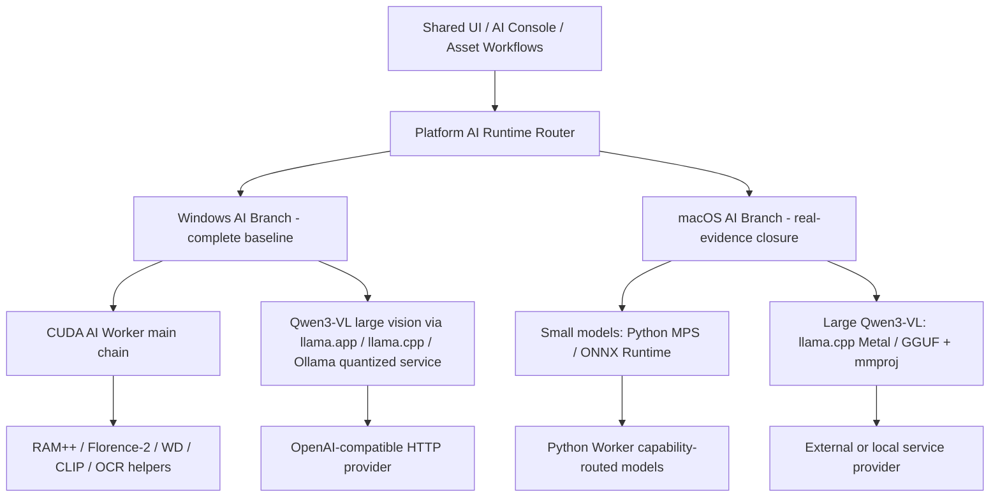

# Windows / macOS AI Platform Branch Reuse Assessment

Design Asset Manager must treat Windows and macOS AI as two related product branches, not one universal AI stack. The product workflows can stay shared, but runtime execution must diverge where CUDA, Metal, MPS, ONNX, GGUF, and local model services behave differently.

## Platform AI Branch Decision

| Platform branch | Status | Architecture intent |
| --- | --- | --- |
| Windows AI branch | Developed / current baseline | Keep the existing CUDA AI Worker main chain for current small and cooperative AI workflows. Move Qwen3-VL large visual-model inference out of Python CUDA and into quantized model services such as llama.app, llama.cpp, or Ollama. |
| macOS AI branch | Real-evidence closure in progress | Use Python MPS + ONNX Runtime + llama.cpp Metal, with Qwen2.5-VL Ollama and external HTTP fallback. ADR-0007 removes the speculative standalone MLX product route. App-owned probes now verify GGUF/mmproj multimodal inference and CLIP ONNX image/text embedding; other model families still require route-specific evidence. |

Current code still contains a native Python Qwen3-VL route and CUDA-oriented guard behavior. Treat that as Windows-compatible / legacy-transition code, not as proof that macOS large visual inference is implemented.

## Current Code Evidence

| Area | Evidence | Assessment |
| --- | --- | --- |
| macOS AI branch skeleton | `src/shared/constants/macos-ai-runtime.constants.ts`, `src/shared/types/macos-ai-runtime.types.ts`, `src/main/ipc/ai-runtime.ipc.ts`, `src/main/services/ai-client.service.ts`, and `src/renderer/routes/AiConsolePage.tsx`. | The AI Console now exposes Python MPS, ONNX Runtime, and Llama lanes through runtime metadata, can read live Worker probe data, and surfaces a macOS route overview without changing IPC channel names. The Python MPS compatibility checker is surfaced separately so the MPS lane can be distinguished from the broader worker-probe payload. The Llama lane also shows configured Ollama and external HTTP fallback status from AI backend settings and manual health/model-list results. |
| Native Qwen3-VL provider | `src/main/services/ai-worker/ai-worker-manager.ts` routes `native-qwen3vl` to `provider.prompt.qwen3vl` and returns CUDA-oriented device/error metadata. | Useful as Windows legacy/transition code; not reusable as the macOS large-vision route. |
| Qwen3-VL subprocess worker | `src/main/services/ai-worker/providers/qwen3vl-prompt.provider.ts` spawns `ai-service/prompt_workers/qwen3vl_prompt_worker.py`. | Windows CUDA-oriented native path; should be bypassed or demoted for macOS large visual inference. |
| Qwen3-VL Python worker | `ai-service/prompt_workers/qwen3vl_prompt_worker.py` checks CUDA, uses CUDA memory cleanup, and emits CUDA diagnostics. | Not directly reusable for macOS Qwen3-VL large models. Could provide prompt/schema logic only. |
| Llama runtime planning | `src/main/services/llama-runtime/llama-runtime-planner.ts` includes Windows CUDA/Vulkan/CPU packages, macOS arm64/x64 packages, Qwen3-VL GGUF candidates, and mmproj support. | Reusable foundation for both branches; macOS still needs app-owned GGUF/mmproj multimodal completion evidence. |
| Llama runtime install/start | `src/main/services/llama-runtime/llama-runtime-install.service.ts` detects Windows NVIDIA/CUDA and macOS hardware, can start `llama-server`, and handles non-Windows executables. | Partially reusable; installer/start behavior is still sensitive and should remain explicit. |
| External OpenAI-compatible provider | `src/main/services/ai-worker/providers/openai-compatible.provider.ts` and `llama-openai.provider.ts`. | Highly reusable for llama.app, llama.cpp server, Ollama, LM Studio, and custom HTTP runtimes. |
| AI backend settings | `src/shared/types/ai-backend.types.ts`, settings services, AI Console backend controls. | Reusable shared contract surface, but visible copy and routing must reflect platform-specific branches. |
| Python AI Worker | `ai-service/app.py`, `core/`, `workers/`, `models/`. | Reusable as task orchestration and small-model host, but model wrappers often assume CUDA/CPU fallback and need MPS/ONNX capability routing for macOS. |
| CLIP/SigLIP ONNX compatibility checker | `ai-service/core/clip_siglip_onnx_compat.py`, `ai-service/tools/check_clip_siglip_onnx_compat.py` | Provides a dedicated environment-and-model-shape check for the macOS ONNX embedding route so AI Console can rely on a real local compatibility probe instead of a synthetic placeholder. |
| CLIP ONNX embedding probe | `ai-service/core/onnx_model_load_probe.py`, `src/main/ipc/ai-runtime.ipc.ts` | Runs a generated image plus local text through the registered CLIP graph. A finite image embedding promotes only Search Embedding; CoreML execution failure may fall back to CPU without changing the shared workflow contract. |

## Reuse Matrix

### Shared As-Is Or Mostly Shared

| Module / concept | Current files | Why macOS can reuse it |
| --- | --- | --- |
| Product UI workflows | `src/renderer/routes/`, `src/renderer/components/asset/`, `src/renderer/components/tag/`, `src/renderer/components/library/` | Asset browsing, tag review, prompt reverse panels, and inspector UX are platform-neutral workflows. |
| Shared contracts and data shapes | `src/shared/types/`, `src/shared/contracts/`, `src/shared/constants/` | IPC and DTO shapes can stay stable if platform selection is expressed as settings/runtime metadata instead of new channels. |
| Asset, tag, download, search services | `src/main/services/asset.service.ts`, `tag*.service.ts`, `download.service.ts`, `search.service.ts` | These are not tied to CUDA or Metal and mostly depend on local database/file abstractions. |
| SQLite schema semantics | `src/main/db/schema.ts` | The data model is platform-neutral; migration risk is path-related, not AI-backend-specific. |
| External HTTP provider | `OpenAICompatibleProvider`, `LlamaOpenAIProvider` | Works for llama.app, llama.cpp OpenAI-compatible server, Ollama-compatible flows, LM Studio, and custom endpoints. |
| Prompt templates and output schema | `src/shared/constants/prompt-templates.constants.ts`, `ai-service/prompts/qwen3vl/` | Prompt language and structured result fields are reusable across CUDA, Metal, MLX, and external services. |
| Runtime package planning contracts | `src/shared/types/runtime-package.types.ts`, runtime package skeletons | Good foundation for platform-specific runtime package planning without forcing downloads. |
| Doctor shell and reports | `src/main/doctor/`, `src/main/services/doctor/` | Check framework is reusable; individual checks need platform-specific implementations. |
| Managed path governance | `src/main/platform/`, `src/main/path-migration/`, `docs/platform/PATH_*` | Cross-platform path ownership is central to macOS portability. |
| Packaging governance | `package.json` build config, `docs/platform/ELECTRON_PACKAGING_AUDIT.md`, `NATIVE_DEPENDENCY_PACKAGING.md` | Windows/macOS packaging already shares electron-builder concepts; native dependency inclusion remains shared. |

### Reusable With Platform Adaptation

| Module / concept | Current files | Required macOS adaptation |
| --- | --- | --- |
| AI Console runtime cockpit | `src/renderer/routes/AiConsolePage.tsx`, `AiRuntimePanel.tsx` | Add explicit Windows/macOS branch labels and route Qwen3-VL choices through service backends on macOS. |
| AI Runtime abstraction | `src/main/services/ai-runtime/`, `src/shared/types/ai-runtime*.ts` | Keep shared workflow/status contracts while exposing `python-mps`, `python-cuda`, `onnx-runtime`, and Llama lane evidence. |
| Runtime profiles | `src/shared/types/runtime-profile.types.ts`, `src/main/bootstrap/` | Keep Apple Silicon small-model MPS/ONNX and large-model llama.cpp Metal service routing explicit. |
| Llama runtime planner | `src/main/services/llama-runtime/llama-runtime-planner.ts` | Keep package selection and make macOS Metal and external OpenAI-compatible service priority explicit. |
| Llama runtime installer/start | `src/main/services/llama-runtime/llama-runtime-install.service.ts` | Reuse hardware detection and server start where approved; keep downloads/install user-triggered. |
| Python Worker queue and workers | `ai-service/core/`, `ai-service/workers/` | Queue/scheduler can be shared; model execution must become capability-routed by platform and backend. |
| Small model wrappers | `ram_tagger.py`, `clip_design_classifier.py`, `wd_tagger.py`, `florence2_tagger.py`, translation/OCR helpers | Add MPS/CPU/ONNX preference, local-only model lookup, and explicit unsupported states instead of CUDA-first assumptions. |
| GPU/Memory monitor | `ai-service/core/gpu_monitor.py`, `src/main/services/ai-worker/ai-gpu-monitor.service.ts` | Split CUDA VRAM metrics from macOS unified memory/MPS availability. Do not present unavailable CUDA as a macOS failure. |
| OCR/text providers | `src/main/services/text-detection/`, OCR dependency services | RapidOCR/ONNX may be reusable; the macOS probe now also checks RapidOCR and PaddleOCR family availability. EasyOCR install/search is Windows-biased today and needs macOS dependency governance. |

### Not Directly Reusable For macOS AI

| Module / concept | Current files | Why not directly reusable |
| --- | --- | --- |
| Native Python Qwen3-VL large-model route | `Qwen3vlPromptProvider`, `qwen3vl_prompt_worker.py`, `AiWorkerManager` native path | It assumes subprocess Python execution and CUDA-oriented memory/compatibility behavior; macOS large Qwen3-VL should route to llama.cpp Metal or configured fallback services. |
| CUDA memory guard policy as universal AI policy | `QWEN3VL_MEMORY_REQUIREMENTS`, `AiMemoryGuardService`, `gpu_memory_probe.py`, `clear_gpu_memory.py` | CUDA VRAM cleanup is not equivalent to Apple unified memory or MPS behavior. |
| Windows-oriented Python discovery | `src/main/services/ocr-dependency.service.ts` | It searches Windows Python paths and `where python`; macOS needs separate interpreter and environment handling. |
| Windows CUDA llama package assumptions | CUDA runtime packages and `cudart` handling in Llama planner/installer | macOS does not use CUDA runtime packages; it needs llama.cpp Metal service routing. |
| Host installer smoke assumptions | Windows Sandbox package smoke docs/scripts | Useful as release validation pattern, but not reusable for macOS AI runtime validation. |

## Proposed Platform Routing

## macOS Development Work Items

Status: **Real-evidence closure in progress**.

1. Keep the AI Console lane cards, macOS route overview, runtime metadata, and worker probe bridge stable while later phases add real downloads and inference validation.
2. Add a platform AI runtime router that chooses small-model and large-model routes per platform without changing existing IPC channel names.
3. Add Worker-side macOS capability probes for Apple Silicon and Intel Mac, including `python-mps`, `onnx-runtime`, `llama-metal`, `coreml`, and CPU fallback.
4. Move Qwen3-VL prompt reverse selection away from `native-qwen3vl` for macOS large visual inference.
5. Keep Qwen3-VL result schema, prompt templates, and AI Console workflow shared.
6. Implement small-model macOS capability checks for Python MPS and ONNX Runtime, including a dedicated Python MPS compatibility probe.
7. Keep the completed app-owned GGUF/mmproj and CLIP ONNX inference evidence scoped to their verified workflows.
8. Add static tests proving macOS Qwen3-VL routes to llama.cpp Metal rather than the CUDA Python worker.
9. Add Doctor checks that distinguish CUDA unavailable on macOS from actual AI runtime failure.

## Practical Recommendation

Do not port the Windows CUDA AI Worker by making every macOS model use Python MPS. Keep the Windows CUDA branch intact, preserve shared UI/contracts/data flow, and introduce a platform-aware AI runtime router:

- Windows small/cooperative models: keep current CUDA AI Worker chain.
- Windows Qwen3-VL large vision: route through quantized llama.app / llama.cpp / Ollama service.
- macOS small models: route through Python MPS or ONNX Runtime when model support is real.
- macOS Qwen3-VL large vision: route through llama.cpp Metal, Ollama fallback, or external HTTP.
- Shared result sync: keep Electron-owned queue sync and SQLite writes.
