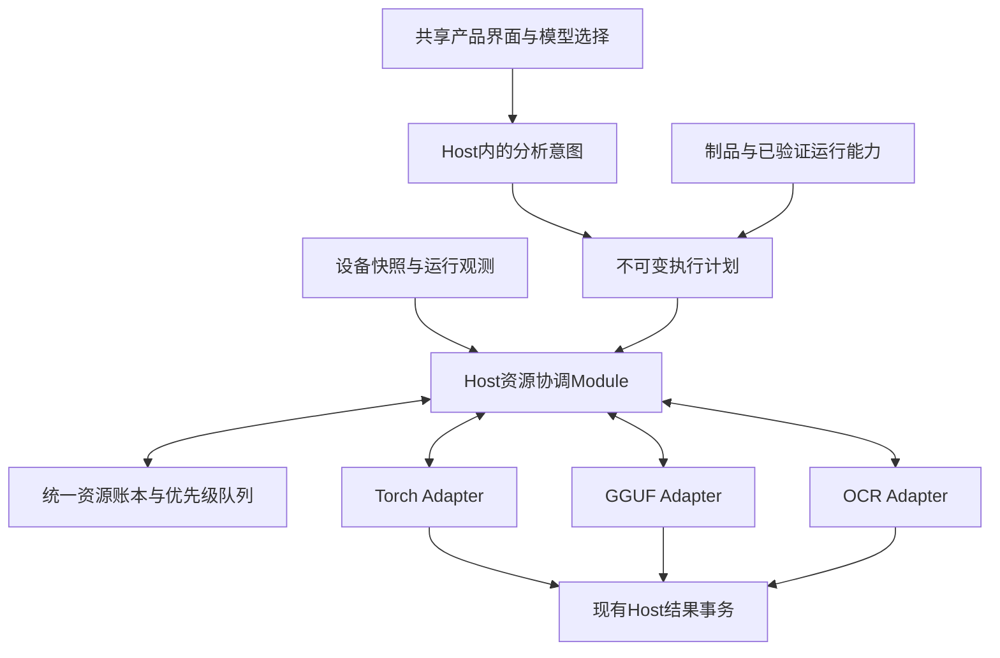

# 本地AI资源、分析与检索底座重新设计

2026-10-06。状态：新版设计草案，待整体共享理解确认。Q13用户要求调整；随后扩大成熟工程参考，Q15确认检索底层纳入本轮设计，Q16确认已验证模型离线可用，Q17确认中文文字/组合条件、语义文字与以图找。Q7–Q12其余选择保持。固定源码研究与可审阅修订已保存；没有产品实现、资源改善或检索通过的完成声明。

## 用户结果与已确定范围

用户从现有“AI与模型 → 本地模型与OCR”获得符合设备实际余量的量化模型建议；选择、安装、验证并用于标签/描述/OCR，已安装且资格未改变的模型离线继续可用。素材工作区支持中文文字/组合条件、自然语言找图及以图找相似素材，展示命中依据和语义覆盖。运行中系统减少峰值和重复加载，保持桌面响应；资源变化时解释“等待、保温、回收、重新加载”的原因。依然从正式应用保存并重开验证。

此前已确认完整HF量化目录、官方优先社区补充、先运行2B/4B/8B Instruct GGUF和默认平衡。资源层这次重新设计：默认平衡，可选最省资源/响应优先；同一模型与量化精度内，允许在新任务前自动选择已验证的GPU/混合/CPU加载方式及回收空闲驻留；执行中的计划冻结。换模型或精度由用户选择。既有Torch、OCR、新增GGUF及Q15/Q17明确增加的本地检索模型/索引维护/查询是本轮消费者，扩散图像生成不纳入。

已确定输入与结果标准保持：资源调度不能自动缩图、截上下文或减少输出要求。明确的本地OOM且Host确认没有保存结果时，可以清理owner、重新取样并以同模型/精度已验证的较低占用计划重试一次；计入原总时限和总调用上限，失败审计保留。未知提交和云服务不自动走此恢复。

## 现有底座应保留的部分

当前代码已有同Host/同profile权威、正式素材消费者、共享RAM准入、忙闲线程、压力滞后、前后台队列、取消、修订/幂等及实际退出后释放。`visual-admission.ts`按已观测RSS与未观测许可区分预算；`managed-vision-runtime.ts`管理自有进程并复核制品/环境。它们是迁移起点。

当前缺口是资源预算与执行生命周期还以整进程CPU float32模型为主：2B/4B固定16/25GiB加载预算；无正式每GPU采样、权重/工作区/KV/传输分账、已证实的分级回收、跨框架能力声明或按重载成本与压力决定的缓存策略。应将这些责任集中到一个深Module，让实际调用方使用小而一致的Interface；迁移中替换现有重复资源决策，而不是再并排维护多套额度。

## 一致的职责

1. **Host资源协调Module**拥有跨运行时准入、设备选择、优先级、驻留策略、压力收敛和不可变计划。前台优先，后台在安全工作单元边界让出，带aging和有限驻留复用避免饥饿及频繁切换。
2. **Runtime Adapter**拥有它实际加载的模型、分配器、迁移/卸载操作与释放证据。Torch、ONNX、llama.cpp分别声明支持的粒度和成本；不支持部分卸载的Adapter使用已确认的整实例退出。原生GGUF不能套用PyTorch的逐层hook。
3. **设备采样Adapter**提供RAM及每GPU的已知/未知、来源、时间、独立/共享内存拓扑与可用量。UMA只算一份物理池，多卡不能简单加总。外部应用占用影响预算，Host只管理DAM-owned执行。
4. **现有业务执行器与结果Host**继续拥有输入scope、请求/尝试、审计、取消/修订、效果事务及未知核对。资源协调不删除人工内容、保存结果、制品或传输恢复记录。

Host的外部Interface收敛为状态/策略、执行一个有scope的意图、回收空闲资源；计划计算、租约、设备计量、候选校验及Adapter差异藏在内部Seam。Browser继续只调用命名业务动作，不能提交任意路径、分配字节、代码或“已验证”对象。内部分解按实际消费者变化建立，避免无人使用的调度平台。

## 资源分账与准入

| 资源类别 | 如何使用 |
| --- | --- |
| 模型与视觉投影 | 按精确制品、精度、设备布局及实际加载状态记账；语言模型和mmproj共同构成组合 |
| KV与计算工作区 | 按视觉编码/prefill/decode阶段、固定context/图像/输出/batch/并发预算，不由权重大小代替 |
| CPU保温副本与文件映射 | 计入RAM；GPU搬回CPU可能增加RAM，文件映射不等于零内存；不能保证所有框架保留热副本 |
| 页锁定与传输缓冲 | 独立有界；异步预取可能增加CPU及GPU峰值，只在预算和受测Adapter能力允许时启用 |
| 分配器缓存 | 同owner内可复用、可回收与已归还设备分别记录；Torch reserved-active不能直接作为另一个进程的空闲显存 |
| 临时预处理与准备 | 保留现有有界预览/材料准入，避免模型已能放下但输入准备导致OOM |
| 已申请但尚未分配资源 | 防止多个候选同时承诺同一余量；不能把物理free和预算许可相加 |
| 未确认释放 | 继续占用账本，等待owner/设备新鲜证据或实际退出；超时不会归零 |

准入同时受物理余量、已观测/未观测承诺、峰值估计、碎片/大分配余量、其他应用预留和重载/迁移暂态约束。计划使用保守估计并标来源，实际测量持续校正下一次准入；不存在OS级硬锁定百分比的承诺。模型推荐、准备、加载与推理使用同一套预算语义。

CPU工作集、private commit、allocatorallocated/reserved、专用/共享显存以及全设备可用量各保留含义，不混为一个“模型内存”。同进程共享存储仅在可核对的owner与实际storage身份内去重，不推断跨进程张量共享。

## 驻留与压力策略

热驻留、CPU保温与冷制品是按Adapter能力提供的状态。每次任务取得后先保护其模型和工作区，完成或确认中断后才可回收；获得模型到首次执行之间也受保护。默认保持有限热模型，结合近期复用、实际加载成本、占用和当前压力决定时长；最省资源更早释放，响应优先在安全余量内保温。

回收按可兑现能力进行：闲置再生缓存 → 闲置GPU分配/部分模型回收 → RAM足够时CPU保温 → 冷释放。该顺序不要求所有Adapter支持所有层级，不能为了腾显存让RAM爆满。并发传输的双份占用、尚未完成的CUDA工作以及exception保留张量都要计入过渡峰值。

普通压力先停止受影响新后台单位、回收闲置内容，当前单位可完成并原子提交。关键压力通过受管Adapter的有界取消在安全点收敛，丢弃未完整输出并按真实发送/提交状态保留等待或未知审计。释放动作完成、观测有效后才准入其他任务。手动释放空闲资源立即绕过保温窗口，保留活跃保护；停用及退出走原有有界drain和真实退出路径。

策略与调度不可改变用户选定的检查点/权重量化，也不自动转云。改变执行方式必须落在已验证的计划集合；新硬件、运行包、制品或语义配置导致资格变化时仍需正式核验。数据不足则等待、串行或明确呈现不可用。

## 学习并采用哪些上游机制

本次公开源码核对均固定到提交，没有安装这些项目或导入用户资料。

| 项目与固定提交 | 可以借鉴的机制 | 适用边界与许可 |
| --- | --- | --- |
| [ComfyUI](https://github.com/Comfy-Org/ComfyUI/tree/7a5dad695fe1cae25efcb2550530fb20ef68da3d) | 权重与计算分账、受保护模型、分级驱逐、受压力影响的有限结果/权重缓存；动态VRAM与按需fault | 动态路径需特定PyTorch/算子/AIMDO；主源码GPL-3.0-or-later |
| [AIMDO](https://github.com/Comfy-Org/comfy-aimdo/tree/3b8e8c162efeb9470d912609a7a6e7a2b1c693ec) | VBAR驻留、逐层按需传输、设备余量与优先级、CPU文件后备 | 自有allocator和运行条件；GPLv3；虚拟地址预留不等于物理VRAM使用 |
| [Diffusers](https://github.com/huggingface/diffusers/tree/71774d9bc84600eb4c60522dbf85c4b8cc317e20) | model/group/sequential offload、有界预取、实际activation减少与代价对比 | 扩散VAE slicing/tiling不直接适用于Qwen视觉理解；核心Apache-2.0 |
| [Accelerate](https://github.com/huggingface/accelerate/tree/08198562915f700e0aee3fd1c1b76dd88e6b3bbd) | CPU/offload hooks、磁盘映射、模型dispatch | forward异常的清理仍需owner负责，hook本身不是生命周期保障；核心Apache-2.0 |
| [InvokeAI](https://github.com/invoke-ai/InvokeAI/tree/0ff4a63f0b0aa1ad9a162a17d0c7e62eaece2112) | 锁定驻留、工作内存预留、RAM/VRAM分层cache、物理free/cachecap区分 | smallest-first/LRU并非已证明最优；CPU镜像可选且默认不保证；核心Apache-2.0 |
| [AUTOMATIC1111](https://github.com/AUTOMATIC1111/stable-diffusion-webui/tree/82a973c04367123ae98bd9abdf80d9eda9b910e2) | medvram/lowvram组件迁移与串行任务锁作为对照 | 单PyTorch进程全局状态，AGPL-3.0 |
| [llama.cpp](https://github.com/ggml-org/llama.cpp/tree/8345f333951c661d166b00e6f9362e553768f292) | 原生GPU层、projector位置、KV/context/batch与闲置sleep的明确控制 | sleep卸载模型和KV，不等于保留CPU热镜像；需固定受测构建与实际能力 |

关键源码证据：[ComfyUI加载/回收](https://github.com/Comfy-Org/ComfyUI/blob/7a5dad695fe1cae25efcb2550530fb20ef68da3d/comfy/model_management.py#L939)、[部分加载](https://github.com/Comfy-Org/ComfyUI/blob/7a5dad695fe1cae25efcb2550530fb20ef68da3d/comfy/model_patcher.py#L985)、[Diffusers分组offload](https://github.com/huggingface/diffusers/blob/71774d9bc84600eb4c60522dbf85c4b8cc317e20/src/diffusers/hooks/group_offloading.py#L116)、[Accelerate异常路径](https://github.com/huggingface/accelerate/blob/08198562915f700e0aee3fd1c1b76dd88e6b3bbd/src/accelerate/hooks.py#L186)、[InvokeAI工作内存](https://github.com/invoke-ai/InvokeAI/blob/0ff4a63f0b0aa1ad9a162a17d0c7e62eaece2112/invokeai/backend/model_manager/load/model_cache/model_cache.py#L2200)、[InvokeAI资源计量](https://github.com/invoke-ai/InvokeAI/blob/0ff4a63f0b0aa1ad9a162a17d0c7e62eaece2112/invokeai/backend/model_manager/load/model_cache/model_cache.py#L2338)。

仓库package声明MIT。Q10已确认：使用兼容的宽松许可代码/依赖，保留归属/许可，独立实现GPL项目的调度思想；核心项目许可不能授权其所有插件、远程kernel或模型。直接整合GPL/AGPL代码的发行义务需另有明确选择，不能凭“开源可商用”或“分开进程”视为自动兼容。

## 新增工程参考怎样落到DAM

Q15–Q17把设计扩展到模型、分析与检索底座。[AI工程参考](AI-ENGINEERING-REFERENCE-20261006.md)已核对llama.cpp、Ollama、vLLM、Immich、Tantivy与promptfoo的固定源码、许可、真实机制与代价。优先直接采用固定受测、宽松许可的推理运行包或必要依赖；借鉴Ollama的制品身份、vLLM的缓存/阶段预算、Tantivy的增量提交与稳定读快照。Immich的渐进素材处理机制独立实现，保留已有Host/SQLite/任务与原件语义。具体依赖以本机集成、效果和维护成本决定，用户不承担内部引擎或schema审批。

在当前正式调用链收敛四个深Module，沿已有Seam替换分散决策，不另建通用平台：

| Module | 对调用方承诺的Interface | 内部负责 |
| --- | --- | --- |
| 模型与运行包管理 | 查询可选/已安装组合，核对安装/导入/启用/停用等命名动作 | 固定制品、许可、完整文件组合、平台与依赖、版本指纹、传输/发布/回滚、运行资格与来源新鲜度 |
| Host分析执行 | 执行选定素材范围的独立能力或基础分析，查询进度，取消/核对/明确恢复 | 冻结输入/配方/结果schema，准备复用，真实运行，严格输出校验，已有尝试/事务/人工优先 |
| Host资源协调 | 为受管工作计划取得/释放许可，读取状态/策略，回收空闲内容 | 设备快照、分账、队列、模型驻留、Adapter能力、压力与实际释放证据；分析、检索和索引共同使用 |
| Host检索 | 执行当前库的文字/组合、语义或明确图片查询，读取稳定页与命中依据，管理启用/重建状态 | 有效证据投影、增量水位、分页/排名、独立模型空间、临时查询向量、索引代际/覆盖与恢复 |

UI只提交命名业务动作和已授权素材/查询来源身份。制品路径、索引句柄、SQL、任意下载地址及资格对象继续由Host拥有。独立标签、描述与OCR消费者继续可独立成功，不因索引或某个运行时异常被总开关冻结。

### 模型组合与离线资格

组合指纹贯穿目录、安装库存、真实资格、执行计划、尝试和结果：具体runtime构建、权重全部分片与视觉投影、tokenizer/template/processor、量化、平台/设备布局和语义限制均有身份。GGUF多模态不能只保存语言文件或可漂移模型名。制品去重仅在完整内容身份和受管归属可核对时采用，删除按引用/所有权处理。

Q16明确区分已安装模型的本地执行资格与在线来源检查新鲜度。固定提交、完整字节及可信依赖/运行包已验证、用户未撤信任且未漂移的组合断网仍可运行；在线检查年龄不单独撤销资格。目录刷新失败保留安装、配置和旧结果，呈现最后检查时间与当前未知状态；不声称离线已获最新远程撤销信息。已知撤信任/适用阻止信息、损坏或环境变化仍拒绝或要求重新本地验证，旧缓存不恢复授权。

新下载/更新的来源、许可、完整性与平台核对仍在相应安装路径进行，目录刷新不能自动升级、激活或重跑全库。此HF方向承接ADR0206/0207对新安装与已有执行的区分，但HF来源不冒充其DAM签名官方离线包。必要变更限于当前HF安装/执行及新受管组合，不删除其他发布/已知撤销语义。

### 分析配方、受约束输出与复用

llama.cpp正式Adapter明确其schema/grammar子集，标签/描述配方可用约束生成减少格式失败；现有Torch或外部服务无相应能力时继续经验证的普通生成与严格后验校验。完整字段、长度、完成原因、输入修订及结果语义仍由Host校验，合法JSON不证明描述事实或OCR准确。配方版本绑定模型/template、受控输入视图、schema与原总时限/调用上限；输入覆盖及输出标准保持。

预览/解码材料、视觉编码/KV等运行缓存与已保存能力证据分别管理。缓存键覆盖内容及视图修订、库/会话权限、模型/runtime/processor/template与配方；缓存大小、传输暂态和回收均进共享账本。先共享一次基础分析适用的准备材料与模型驻留；合并物理推理或KV复用须证实输入/配方兼容及逐能力校验，失败不将半份输出当三能力成功。明确“重新分析”保留新尝试，不被旧缓存伪装成新模型执行。

持久结果属于库的证据，不能被资源LRU或清理分析缓存删除。索引重建可复用已保存结果；换模型/配方不会隐式重分析所有旧素材。旧有效结果与用户编辑继续保留，迟到结果由当前修订/授权决定能否成为current。

### 三种检索与增量投影

Q17确认中文文字/组合条件、语义文字和以图找。复用既有Hybrid Asset Search Plan、Lexical/Semantic Retrieval Lane、Search Match Explanation、Active Embedding Space等术语及ADR0181–0184；本轮针对当前库与现有支持的受控素材视图，不以旧长期规格自动加入跨库/跨站、所有格式页帧或设计助手。

当前Library正式共享UI的asset-discovery.workflow已经匹配名称/文件名、标签/别名、描述、OCR、有效AI建议及反推，标示最多三条命中依据，但读取全库后在Renderer匹配排序，变更再全库重读。另一个Host searchAssets字段更窄且同样全读。新检索Interface统一这些实际字段、组合条件和来源语义，保留用户当前includes-pending范围与AI建议标识、人工描述/OCR修订优先、反推作为创作推演的独立命中类型；不能迁移成仅搜名称，不能把建议确认化。

词法投影从Host已提交的有效当前内容产生，保留字段、语言、确认/建议状态、资产/证据修订与来源。优先评估现有SQLite内的有界增量/全文方案；有需要才采用嵌入式搜索依赖。中文字符、分词、短标签、别名、多词跨字段和组合条件需实测保留/改善。Tantivy提供机制参考，实际引擎选择不改变这些契约。

Host按稳定查询/索引代次返回有界IDs、当前修订、排名、命中依据和opaque cursor，再窄读所需展示；取消/换库撤销查询，分页不重复/漏项。硬条件先约束候选；词法与语义按版本化融合比较排名，精确标题/确认标签不会因语义分低而消失，也不直接相加不同尺度分数。

索引更新使用独立dirty记录/消费水位，随业务事务登记受影响身份并幂等消费。现有AI通知outbox只拥有其通知delivered语义，不被第二消费者抢用。业务保存成功与派生索引提交/读快照可见分别表达；人工保存后新词可查，待索引更新时可合并有界dirty投影或明确更新状态。结果返回前按Host当前会话/修订/回收/有效证据复核，过时命中不泄漏或复活。重建新代次、核对水位/覆盖、原子切换，保留适用旧代次；损坏或落后以partial/rebuilding及修复表达，不用空成功伪装无素材。

### 独立检索模型与索引代际

语义文字和以图找使用具有图文或适用同空间能力、中英文证据及明确许可的独立本地检索组合。用户随后明确语义检索包含中英文：中文、英文、中英混合查询及跨素材描述/标签语言找回均纳入。模型的多语言声明需要真实双语查询验证；不默认调用LLM翻译替代双语能力。Qwen生成模型的描述输出、目录中的Embedding名称和CLIP/SigLIP forward probe不能代替正式检索资格。具体组合由公开来源/平台/资源与指定查询效果比较选择，精确模型/文本与图像processor、维度、归一化和距离构成空间身份；图文查询及库向量必须相容，同维数不等于同空间。

用户从检索设置明确启用/准备模型与范围，搜索输入本身不隐式下载、外发、启用后台全库分析或调用LLM翻译。词法搜索独立可用；无向量、模型未准备、中英文所需能力不足或索引重建只影响相应语义lane，显示覆盖与原因。单一语言通过不能关闭双语检索目标。以图找只读取当前库选定素材视图，或通过正式文件选择/明确拖入取得的一文件一会话授权，不收录查询图、不扫描邻近目录；查询图与向量临时释放，不保存普通搜索历史。

Canonical Embedding Result是可验证的持久分析结果，ANN Search Index是可重建派生数据，各自预算、存储与清理语义独立。索引损坏从canonical vectors恢复，不需要重跑模型；新模型空间另建向量与索引，达到声明范围的覆盖/检索验证后切换。原空间在准备期间保持可用，查询与分页固定对应空间/代次，不混合新旧向量；重新生成向量属于明确范围的分析/迁移，重建索引属于派生维护。必要schema/持久文件通过现有Host维护、备份/恢复与版本兼容路径接线。

检索前台工作与Qwen/OCR后台、向量生成、索引合并共用资源协调。词法查询不等待模型加载；检索模型与语义查询按实际可用预算排队/保温，不能为立即搜索驱逐活跃受保护单位。后台向量/索引工作有界批次、暂停与恢复；资源策略不截断用户查询或改变已选模型空间。

### 性能、质量与普通诊断

沿指定公开素材/库/profile建立固定输入、模型/组合/配方、查询及人工可核对目标的版本对照。分别测加载/运行资格、完整结构、内容质量、检索相关性与产品保存重开：标签无据推测、描述事实、OCR有字/无字、中英文语义/相似素材命中和解释均有独立证据。语义验证包含同概念中英查询对、混合查询与跨语言目标，按语言分别记录质量/延迟，不要求两种语言排名完全一致。新增模型或索引不能借旧CPU验收直接放行。

资源与性能记录排队、准备、冷/热加载、视觉编码/prefill、生成、校验/提交、索引更新、查询/分页、取消/真实释放的阶段耗时与RAM/VRAM；用户终点是正确结果保存和可找回，首token与吞吐单项不替代。对照同输入与质量标准；比较可见响应/取消、连续任务与Chrome指定公开网站组压力，给实际测值和口径，不先承诺固定改善比例。大规模复制/生成数据仅作规模基准并注明，不能冒称真实大库质量已验收。

可选promptfoo作为开发评测工具或采用少量必要确定性断言，保持完整JSON/完成原因与真实内容评价。默认外部embedding/judge不进入评测；本地或已授权服务、公开范围和预算继续有效。诊断按执行实例/组合/阶段提供有界错误码和测量，不记录账号秘密、完整环境、原始私人图片或普通查询历史。

## 与当前代码的迁移对应

| 现有责任 | 设计落点 |
| --- | --- |
| `visual-admission.ts`的poolFits/驻留Map/优先级/pressure | 收敛到Host资源协调Module；材料scope、预览容量和codec保护继续在视觉材料Module，跨能力物理资源决策只有一份 |
| `managed-vision-runtime.ts`的固定loadBytes、idleTimer、stop/observe | 成为Torch Adapter的能力、观测与真实退出协议；驻留选择和压力顺序由Host协调；旧已测CPU计划作为保守兼容路径 |
| `ocr-runtime.ts`和OCR实际进程 | 接统一运行租约和实际退出观测，保持独立OCR资格/输入/修订/结果语义；无证据的模型cache与部分offload不声明支持 |
| 新增GGUF运行路径 | 以固定受测原生运行包提供Adapter，明确GPU层/投影/KV等加载能力；不因其他框架支持逐层迁移而假设本运行包也支持 |
| `ai-resources:read/configure`及现有资源界面 | 同一正式Interface增加每设备已知/未知与分账、计划/回收原因；保持唯一Host和客户端角色校验 |
| 基础分析/后台执行器 | 使用同一执行意图与资源租约；保存与中断事务仍由既有Host负责，等待资源不反复建请求/尝试 |
| `asset-discovery.workflow.ts`、Library与`assets:list/searchAssets` | 收敛正式Host检索/稳定分页和增量读索引，保留现有字段/命中依据/建议范围及人工优先；Renderer持有可恢复查询/选中状态 |
| 检索模型、canonical vectors与派生索引 | 新的实际资源消费者；精确空间、启用/生成范围、覆盖与代际切换归Host，查询图/向量保持临时，已保存结果与索引分开 |

模型推荐偏好与运行资源偏好分开：前者沿ADR0171比较省资源/平衡/质量的模型候选；后者在已选模型内权衡驻留、回收与响应。响应优先不等于更大模型或质量更高，前台交互优先不等于无限并发。界面复用现有资源策略入口，解释实际采用的行为。

## 实施与完成门槛

1. 将新鲜设备采样与统一资源账本从现有材料/编解码职责中收敛到Host资源Module，迁移真实调用方和准备/计算/驻留生命周期。先保持当前CPU/OCR路径及取消、unknown和前后台独立性。
2. 按实际Adapter能力引入执行计划、驻留层级、受保护单位、回收证据和受压力影响的缓存策略。替换当前固定加载估计与无证据回收假设；估计仍保守并区分未测状态。
3. 接入此前HF组合目录与正式受管GGUF，统一推荐/安装/资格/执行的资源语义，完成GPU/混合/CPU真实路径，区分已安装离线资格与在线来源新鲜度。接必要schema约束、准备复用和阶段诊断，保持逐能力校验/保存。不得为了证明动态逐层卸载而把研究脚本当产品。
4. 把共享UI与Host两条词法语义收敛到正式增量检索/稳定分页；验证全部现有字段、中文/组合条件、人工修改可见、删除/修订排除、解释、重建与重开，避免全库Renderer扫描成为正式查询底座。
5. 接独立本地检索组合、启用与范围、canonical向量/派生索引和空间迁移，完成自然语言找图与以图找；模型/索引问题保留词法与管理，检索/生成/索引和既有分析共用预算。
6. 在同输入/制品/配方及可比条件下记录冷/热加载、持续任务、模式切换、其他应用压力、OOM一次恢复、取消/退出重开和占用收敛；对中文/语义/以图检索核对真实命中/依据/覆盖、索引更新与保存重开。量化或后端变化不是纯资源优化对照，结果质量与资源效果分别核对。

保留指定公开素材/库/profile、人工描述、确认标签、OCR修订和原件，使用可恢复副本做故障。Chrome指定公开网站组作为其他应用负载，不关闭用户原页；只读取允许的设备计量，不读进程环境、凭据或内存内容。

真正完成需要：普通正式入口 → 设备/推荐可见 → 下载安装及真实资格/离线使用 → 正确分析 → 文字/语义/以图找与依据 → 资源/取消/压力及索引实际行为 → 保存重开，无自动重发未知记录。必须拿到实际RAM/VRAM、延迟和检索相关性证据才能声明节省、加速或找回能力；文档、构建、静态预算和假成功不关闭父级用户目标。GGUF未支持的细粒度迁移如实说明，其他已批准加载方式与独立能力继续。

本轮设计范围为资源协同、量化使用、必要分析底座、已安装模型离线与Q15/Q17指定检索。检索是最新明确增加的范围，未自动授权其他C–F目标或扩散图像生成；基础文件、账号与库权威/事务沿用。新版整体共享理解确认后连续实施，不逐Interface或切片问继续。
