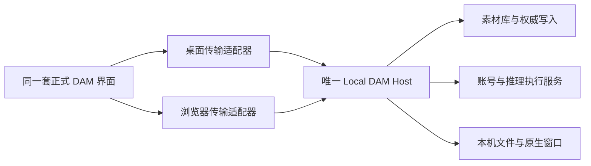

# DAM 正式本机双客户端设计

状态：完整设计已获用户确认（“我觉得没问题”），2026-10-02。下文区分已确定需求、
现有事实和实施方案，不代表浏览器端已交付。用户随后指定 `to-spec`，本轮将方案
合成为[可实施规格](LOCAL-DUAL-CLIENT-SPEC.md)并发布到项目 Issue tracker；产品代码尚未实施。

## 已确定的目标

- Browser Asset Workspace 是正式本机客户端，供用户与 Codex 日常使用。
- Desktop 与 Browser 使用同一套正式 React 界面，连接同一个 Local DAM Host。
  页面、业务流程和展示组件不另写简化版本。
- 文件、目录、数据库、账号、推理与后台任务由本机 Host 执行；浏览器呈现操作。
- Browser 使用 DAM 页面内文件/目录选择器，整个选择流程能在内置浏览器操作。
- 后续开发以 Codex 内置浏览器操作完整用户路径为主要验证入口。
- 完整业务路径由浏览器验收；原生窗口、托盘、跨屏与跨应用交接保留专项验收。
- MeshCentral 方案已放弃并清理，不再将远程桌面作为新架构依赖。
- 提供桌面版与浏览器版双入口，连接同一 Host；关闭当前界面不退出后台，明确
  “退出 DAM”才检查未保存内容、排空任务并退出。浏览器入口不要求先开桌面主窗口。
- 选择器支持本机盘符、逐层浏览、输入路径、选择文件和创建目录，使用当前用户
  已有权限；Codex 开发 profile 只允许合成测试根。
- 两端允许同时使用同一个当前库；提交同步，冲突时提示并保留存活客户端草稿。
  切库/退出必须检查另一端与工作窗口的未保存内容。
- 本轮覆盖全部现有正式业务的双端等价；不补齐当前禁用或未交付的模型安装/推理。
- 草稿定期暂存本机，重新进入提示恢复；草稿不冒充正式保存、不自动覆盖素材。
  能恢复 Host 已接收的草稿，崩溃前尚未传出的最后输入仍可能丢失。

“浏览器客户端”指本机 DAM 产品界面，不恢复已移除的网页采集或网站搜索功能。

## 访谈树

| 决定 | 当前状态 | 后续分支 |
| --- | --- | --- |
| Q1 浏览器产品定位 | 用户选择正式本机客户端 | 启动、退出、权限和故障必须作为产品交付 |
| Q2 文件/目录选择方式 | 用户选择 DAM 页面内选择 | Q5 可浏览范围、路径输入、创建目录、选择授权 |
| Q3 验收边界 | 用户选择业务浏览器验收，原生行为专项验收 | 原生窗口映射、交接与发布证据分别报告 |
| Q4 普通启动与最后一个客户端关闭 | 用户选择双入口、明确退出 | 关闭当前界面不退出 Host，浏览器启动不依赖可见桌面主窗口 |
| Q5 页面内选择器范围 | 用户选择完整本机选择器、测试隔离 | 产品逐层浏览本机，开发 profile 强制仅合成根 |
| Q6 两端同时操作 | 用户选择共用当前库、提交同步、冲突提示 | Q8 意外关闭后的草稿保护层级 |
| Q7 已实现功能与未交付 AI 的范围 | 用户选择现有正式功能双端等价 | 未交付模型能力单列，不恢复禁用通道 |
| Q8 草稿恢复层级 | 用户选择本机暂存、提示恢复 | 草稿与正式保存分开；尚未传出的最后输入可能丢失 |
| Q9 完整设计共识 | 用户回复“我觉得没问题”，已确认 | ADR 转为 Accepted；本轮按 to-spec 生成并发布规格 |

所有产品分支已收束。完整共识包括下列模块划分与公共兼容 Seam 的新增适配，
不代表真实模型、原生专项或产品包装已经验证通过。

技术上可查明的事实由 Agent 调查，不要求用户选择 HTTP 协议、队列或数据库实现。
已确认范围以本稿与可实施规格为准；后续实现中的常规技术选择由 Agent 据实际调用方决定。

## 当前事实和能力差异

| 能力 | 当前接线事实 | 浏览器需要的工作与验收 |
| --- | --- | --- |
| 素材界面、文件夹、检查、笔记、工作集 | 已有共享展示组件；43 个 Renderer 文件直接取得 electronAPI | 共享 Client Interface，在 App/Store 初始化前选择 transport；视觉与正式保存分别验收 |
| 素材库与权威写入 | ActiveLibraryHost 持有 SQLite 与独占锁，AppStorage 独立 | 两端只连接一个 Host，不能各开数据库；切库命令共用一条队列 |
| 系统文件与目录 | 原生选择器会显示、聚焦主窗口 | 已选页面内选择器；Host 校验选择会话，不能信任浏览器任意路径请求 |
| 本地媒体 | dam-preview 协议，读取前后检查库身份和代际，工作窗口另有成员权限 | 共享媒体权限 resolver；增加受控 HTTP 地址，禁止泛化为本地文件服务器 |
| 账号与视觉/标签推理 | Main 连接服务、独立 Pi Node 进程与 OCR Python 进程；部分 provider 有准入 | 复用执行服务，账号秘密只在 Host；真实登录与真实推理仍需单列实际证据 |
| 模型安装与旧 Runtime | 正式 disabled-app 表拒绝多类旧通道；Model Library 核心部分仍为隔离验证 | 不把页面存在当作可运行，也不借 Browser 绕过准入；未交付能力单列范围 |
| 工作窗口 | 独立 sandbox 原生窗口，最多八个；共享 WorkReferencePanel | Browser 可以命令 Host 开窗；网页内面板不能证明原生置顶、几何或跨屏 |
| 跨软件复用 | 当前正式工作窗口的对应动作是回到资料库；原生文件拖出未接线 | 浏览器化不自动交付文件拖出；须证明实际接收应用与平台效果 |
| 通知、重连 | 现有通知主要只发送到主窗口 | Host 事件统一分发，两端按提交状态刷新；重连先重新检查权威快照 |
| 启动、退出、测试隔离 | 无现成单实例接线；Windows 所有原生窗口关闭后退出，仍有工作窗口时关主窗口会隐藏它；普通 SettingsService 固定用户路径 | 每 profile 一个 Host；区分页面离开与 Host 退出；开发 profile 显式隔离全部状态 |

这些事实来自源码与局部说明。本轮没有启动正常应用、读取真实素材/模型/凭据或执行推理。

## 确定的架构

本轮由 Electron 承载唯一 Host，保留已有原生依赖、系统凭据保护、窗口和推理
执行服务。桌面接 IPC，浏览器接仅本机回环的 HTTP 与事件通道；双方共用正式 Renderer
构建和业务契约。已确认双入口；浏览器入口启动 Host 并打开浏览器界面，Desktop 窗口
按需打开。关闭一个表面只解绑该客户端，明确退出才进入全 Host 的审查和排空。

另一个选择是独立 Node Host，但需要同时替换系统凭据、原生选择器、窗口服务与原生
依赖打包。这是实质取舍，不因“浏览器客户端”就默认要求重写全部执行服务。

Host 内集中命令编排、客户端身份、Library 切换队列、媒体授权与事件出口。HTTP 不伪造
Electron sender/event，IPC 也不重复创建另一套服务。每个客户端取得 Host 签发的身份与
会话、角色与能力范围；请求、动作凭据和草稿回执必须绑定真正的所属客户端及当前库
代际。主表面与工作窗口继续有不同授权，普通 Browser 身份不能调用任意工作窗口 API，
工作窗口的成员限制不能被统一 Client Interface 消除。

新增 HTTP 命令面、选择凭据、事件、角色和错误语义属于公共兼容 Seam，实施时
同步 shared 契约及直接调用方；现有 IPC 名称、正式保存语义和 schema 规则保持
兼容。新增客户端权限在 Host 校验，不将网页控件可见性当作授权。

## 约束与故障场景

- 浏览器访问仅本机，不对局域网开放。页面与命令使用同源授权，校验 Host/Origin 与
  会话，拒绝其它网站、未知客户端、通用 SQL、任意进程执行和任意文件读写请求。
  由本机程序启动时签发短期授权，兑换客户端会话；敏感授权不进入日志、历史或
  报告。无需建立类似 MeshCentral 的登录账号，也不新增自签名测试 CA。
- 已选页面内目录选择；Host 签发短期选择会话和不透明结果凭据。浏览器展示目录，
  不能自行声明一个字符串已获得素材库、模型目录或执行环境权限。
  浏览目录与确认操作是不同阶段，选中目录不自动取得库写锁、模型激活或进程执行权。
  创建目录只执行用户在选择器内明确发起的动作，开发 profile 拒绝越界与链接逃逸。
- 两端同时编辑时要保留用户草稿、发现版本冲突，不能静默覆盖。切库、关库、退出应
  汇集所有客户端和工作窗口的未保存状态，确认后才排空与撤权。
- 当前草稿主要在 Renderer 内存。实施增加 Workspace Recovery Draft 暂存与接收回执，
  UI 显示最后暂存状态；重新进入时由用户选择恢复或放弃，正式保存成功后清除对应
  草稿。恢复先校验库/素材身份和保存基线，冲突时保留内容供复核，不能自动重放。
  暂存只归本机 profile，秘密凭据不进入草稿；不得把断网时未送出的输入标为已暂存。
- 页面关闭、断线、重连、Host 重启、文件移除和模型不可用必须有可恢复的明确状态。
  页面离开只解绑，不自动取消由 Host 管理的账号生命周期。
- 普通启动与合成开发 profile 必须分离，设置、凭据、应用库、素材根、日志和身份都
  明确归属。仅设置 userData 目录不能证明隔离，开发入口不得顺带读取真实用户配置。
- 新浏览器授权不扩大来源文件修改、外部 provider 上传、模型下载或真实库迁移权限。
- 工作模式在 Browser 复用正式工作集编辑与参考展示组件；可向 Host 发出打开/置顶
  真正桌面工作窗口的命令。浏览器工作视图与原生窗口布局分开，网页坐标不能冒充
  已保存的系统窗口几何，角色间读写继续受范围约束。

## 交付与验证

### 模块划分

| 模块 | 负责的产品意图 | 保留在模块内部的细节 |
| --- | --- | --- |
| Host 启动与生命周期 | 启动/发现同一 profile 的 Host，打开客户端，明确退出 | 进程、端口、单实例、平台生命周期、受控 profile 路径 |
| Host Command Facade | 接收业务命令、检验身份与角色、串行切库、审查全局草稿 | Electron sender、HTTP 会话、receipt 所属、库锁和排空 |
| Shared Client Interface | 正式 UI 调用业务与订阅结果 | IPC/HTTP 传输、断线和错误映射；不暴露任意 invoke |
| File Selection Sessions | 按目的浏览、选择、确认文件/目录 | 真实路径、权限、链接解析、短期选择凭据与目录创建 |
| Media / Events | 取授权预览、读取快照、通知已提交变化 | 协议/HTTP URL、成员权限、代际失效、重连 |
| Workspace Drafts / Conflicts | 暂存、提示恢复、保留冲突内容、汇集未保存状态 | profile 暂存、接收回执、保存基线与角色所有权 |
| Native / AI Adapters | 控制已有原生窗口、账号与推理服务 | 系统窗口、凭据保护、平台依赖、Worker 进程和能力准入 |

两端默认使用同一正式文件选择展示组件，使开发验收与日常操作一致。必要的原生
专用行为留在 Native Adapter 并单独验收。每个能力均应有正式调用方或明确不可用
状态，不能仅因 Preload 有方法名就放入可用清单。

在线冲突不假设所有实体已有版本号；按当前契约复用可用 revision，其余在 Host
维护保存基线与并发控制，公共请求语义的新增字段/拒绝结果随契约同步。草稿暂存
属于应用本机状态，不能因此悄悄升级素材库 schema 或改变旧库的只读/迁移资格。

并发核查：Notebook 已检查整本 revision/source/session，OCR 检查 revision 与 evidence，
WorkSet 内容有 expectedRevision；原生窗口布局没有内容 revision，继续只有原生 Owner
写入真实几何。Description 仅有可选 expectedCaption 值比较，两端编辑须始终提交基准。
标签与设置没有通用乐观锁；不能声称以上部分锁证明全应用已防冲突。

恢复草稿按 profile、工作区/客户端、实体和草稿类型隔离，并记录保存基线与草稿序号。
迟到的保存应答不能覆盖后来输入。冲突时保留草稿、读取最新版本供用户复核，不自动
换基准重试。HTTP 写入丢响应属于提交结果未知，无幂等依据的写命令不得自动重发；
事件发送失败不撤销已提交数据，重连必须读取权威快照。

### 交付检查

实施按启动/profile → 唯一 Host 命令面 → Browser transport → 共享 Client Interface →
媒体与事件 → 目录选择及能力接线 → 两端并发与用户路径推进。切片用于减少风险，
不是将完整双客户端请求缩成一个浏览器演示的交付边界。

验收矩阵需覆盖所有正式 Client 方法/事件及不可用能力，证明两端调用相同权威服务。
合成库验证复制导入、真实持久化、重启读取、编辑冲突、切库撤权、断线恢复、重复启动
和跨 profile 拒绝；合成 AI 只证明编排与传输，不能证明模型真实推理。

Computer Use 采用 [UI/UX 验收流程](../agents/ui-ux-acceptance.md)，默认从 Codex 内置
浏览器的普通入口操作可见控件，记录受控 profile 标识、构建、关键步骤证据及复测结果。
浏览器端不可用或工具无法完成路径时转桌面并记录原因；Browser 的失败与未覆盖项仍
单列，Desktop 通过不能替代本设计要求的 Browser 等价验收。原生系统行为直接专项补齐。
后续 Browser CU 继续采用用户指定的 GPT-6 Luna / high 子智能体，主 Agent 复核证据。
后台契约/API/DOM 状态注入测试另列；可见控件定位后的真实点击/键入按 CU 记录。
Q3 已确认原生 OS 行为仍需专项 Computer Use；
网页的成功提示不足以证明托盘、置顶和跨应用交接。页面内文件选择是用户批准的新
浏览器业务路径，不再将弹出 Windows 选择器作为该路径的完成条件。
真实素材、权重、Runtime 与厂商账号的验证，仍需对应目标和数据范围授权。
本会话原生工具不可用时，依赖原生控件的验收记为 `BLOCKED_UX_ACCEPTANCE`；Browser
业务通过、后台契约通过和构建通过不能覆盖这一结果。

## 事实入口

- [共享界面与双验收](../adr/0486-approved-gallery-presentation-is-shared-with-the-formal-workspace.md)
- [工作模式所有权](../adr/0485-work-mode-preserves-reference-context-and-host-owned-media.md)
- [原生工作窗口权威](../adr/0489-work-sets-separate-saved-references-from-native-window-authority.md)
- [Main 组合根](../../src/main/index.ts)、[IPC 装配](../../src/main/ipc/main-ipc-composition.ts)
- [Active Library Host](../../src/main/library-lifecycle/active-library-host.ts)
- [当前 sender 校验](../../src/main/trusted-sender.ts)、[原生选择器](../../src/main/platform/native-open-dialog.ts)
- [Provider 状态](../../src/main/ai-gateway/PROVIDER-MATRIX.md)
- [普通设置路径](../../src/main/services/settings.service.ts)

架构决定见 Accepted [ADR 0491](../adr/0491-local-clients-share-one-host-and-product-workspace.md)。
可实施规格见 [LOCAL-DUAL-CLIENT-SPEC](LOCAL-DUAL-CLIENT-SPEC.md)；实施、验证和正式能力交付仍待后续执行。
规格已发布为 [GitHub Issue #23](https://github.com/zhr0210/design-asset-manager/issues/23)，
标签 `ready-for-agent`；标签不自动恢复历史队列或扩大数据权限。
