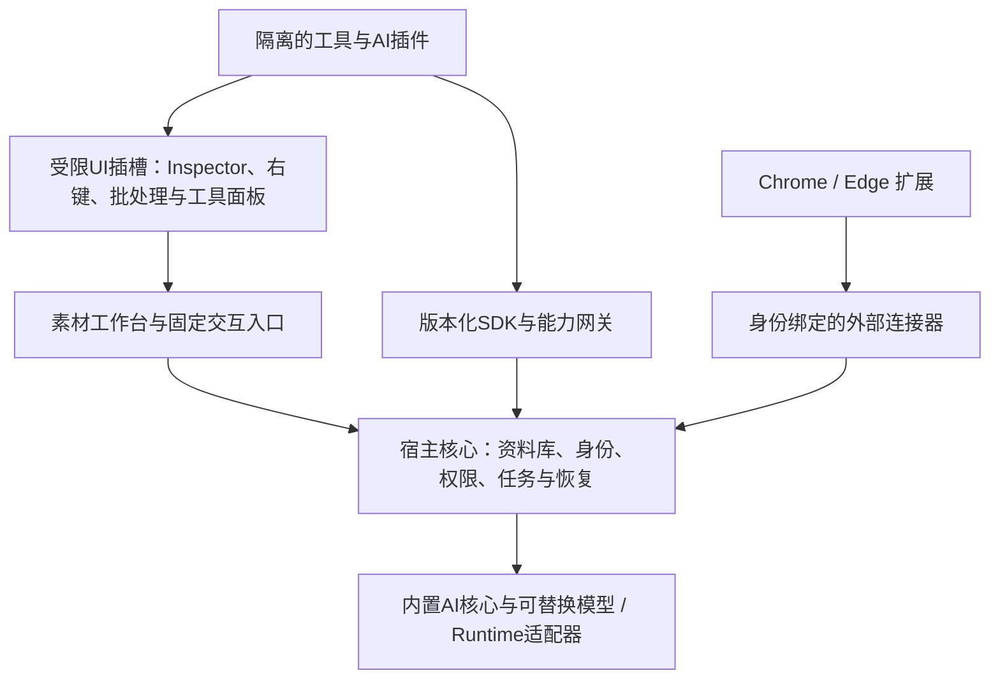

# 素材工作台插件平台：定位、架构与实施难度

2026-09-13，讨论稿。用户希望以软件主体为核心，允许开发者借助自己的AI编写插件，
用户安装后即可使用。本稿是设计建议，不代表已实现SDK、插件市场或浏览器连接器。
网页模块移除是另一项已授权实施任务，范围见对应移除报告。

2026-09-14定位澄清：本稿的初步建议按[产品基准](PRODUCT-FOUNDATION.md)和
ADR 0483/0484修订；其余接口示意仍为未交付的候选设计。

## 定位建议

定位为“本地优先、以AI+为核心的素材工作台”。主产品负责素材收录、理解、
找回、检查与复用，内置配色占比、标签建议、描述和提示词反推等能力；缺少模型时
基础管理仍可用。抠图、可编辑图层与专业工具按需插件化。网站采集是未来外部
浏览器连接器的职责。插件生态围绕真实创作任务发展，不以插件数量衡量价值。

这样可以降低内置网页登录、网站反爬、浏览器版本与采集脚本的维护负担。相应地，
网页到素材库的入口需要浏览器连接器；在连接器交付前，保留本地文件导入与独立
图片直链下载。插件平台也会增加兼容性、安全、分发和支持工作，不能只靠目录拆分完成。

## 从DeepSeek Harness借鉴什么

官方架构通过Cordis组合插件，插件提供服务、类型化事件及可撤销的注册效果；
能力定义、提供者和调用方共同构成替换点。配置组合与插件生命周期值得参考。
[DeepSeek Harness官方架构](https://github.com/deepseek-ai/deepseek-harness/blob/master/docs/architecture.md)

对本项目的建议：官方核心组件可以模块化，第三方插件经受限SDK接入。素材库写入、
原件保护、权限和持久事务由宿主统一控制。依赖注入负责组合，执行隔离和授权需要
另外实现；采用某个插件框架本身不会自动获得这些保障。

## 建议结构



| 层 | 职责 | 对第三方的边界 |
| --- | --- | --- |
| 宿主核心 | Library身份/锁、素材事实、Copy/Trash、任务与恢复、用户确认 | 不让插件直接替换写入和授权规则 |
| 能力网关 | 校验输入、能力权限、当前选择、版本及调用来源 | 不暴露SQLite连接、任意文件路径或通用Electron IPC |
| 插件运行时 | 加载、生命周期、资源预算、崩溃与取消 | 隔离执行；独立进程只是组成部分，不是完整权限方案 |
| UI扩展点 | 工具命令、检查器面板、批量动作、可选视图 | 优先使用宿主组件；自定义界面隔离，不能访问完整electronAPI |
| 分发管理 | 安装、禁用、更新、卸载、兼容检查与回退 | 安装过程不默认执行第三方安装脚本 |

Electron官方建议隔离不可信内容，启用适用的沙箱，校验IPC发送者并限制暴露能力。
第三方插件不能直接在当前有完整本地权限的Main进程执行。
[Electron安全建议](https://www.electronjs.org/docs/latest/tutorial/security)

## “统一接口”具体是什么

它是一套统一的生命周期、类型、错误和能力协议，按场景提供小接口。首版可以开放：

- 当前选择：读取本次选中素材的标识及必要元数据。
- 受控输入：申请读取选定预览；原件读取是独立能力。
- 素材处理：生成派生结果并提交预览/入库提案，由宿主执行确认和写入。
- 元数据：提交标签、描述、调色板等建议；用户确认状态仍由宿主管理。
- 任务：进度、取消、失败与恢复信息，统一展示。
- 插件存储：命名空间内的设置与缓存，不允许随意增改主库表。
- AI：按本次任务向已选择服务提出调用请求，复用宿主的配置、披露与外发确认。

基础配色与占比提取属于核心；以下例子是可选的专业配色建议。接口只是候选
示意，尚不存在可导入的SDK包，建议色板不能覆盖测量结果：

```ts
registerCommand({
  id: 'palette.professional-scheme',
  title: '生成专业配色方案',
  async run(context) {
    const selection = await context.assets.getSelection()
    const preview = await context.assets.readPreview(selection[0])
    const palette = await proposeProfessionalPalette(preview)
    return context.assets.proposeMetadata(selection[0], { palette })
  }
})
```

安装后先登记清单；普通工具在用户触发命令或打开对应面板时按需激活，避免插件
数量增加后全部常驻运行。后台任务须单独声明、获准并受资源预算约束。

注册返回可撤销句柄。禁用/卸载先停止新任务，再按策略取消或收敛在途任务，最后
撤销命令、事件和UI。已提交素材仍属于用户，不能因卸载插件而消失。
事件用于通知已发生的事实；写入通过显式命令与确认，不靠广播事件获得隐式权限。

## AI辅助开发与简单安装

开发者路径建议是：模板 → 本地开发沙箱 → 类型/权限/行为检查 → 打包 → 分发。
提供清晰的SDK文档、JSON Schema、类型定义、完整参考插件和可复现的测试素材，
让不同AI都能生成符合契约的代码。AI生成的插件仍须经过同样的检查。

用户路径建议是：选择插件包 → 查看来源/兼容性/权限 → 安装 → 启用。
插件包声明id、版本、支持的SDK范围、入口、贡献项和所需能力。先验证并暂存完整包，
成功后原子激活；校验失败保留旧版本。权限增加的升级重新披露；回退需要同时考虑
插件自己的状态迁移。签名证明来源与完整性，不能代替权限控制或功能质量验证。

首版建议支持本地包安装和可信官方示例。市场、自动更新、付费、评分、审核、恶意
插件撤销及长期兼容属于后续建设，避免让用户先承担一个不成熟的生态。

## 外部浏览器如何接入

浏览器连接器负责用户当前网页的采集意图、来源信息和可导出的素材，宿主负责校验、
目标库确认与Copy入库。不要把站点登录Cookie自动转交主程序，也不能用连接器提供的
任意路径直接访问用户硬盘。

Chrome提供扩展与本地程序通信的Native Messaging机制，具有独立的宿主声明与
扩展身份配置；可以作为候选传输。Edge、系统安装注册、消息限额、大文件分块、
超时和断线重试仍需在实际连接器实现时分别验证。
[Chrome Native Messaging官方说明](https://developer.chrome.com/docs/extensions/develop/concepts/native-messaging)

## 难度与实施顺序

| 阶段 | 交付与验收 | 难度判断 |
| --- | --- | --- |
| 内部能力整理 | 选定2–3种真实工具，统一命令、输入与结果，不改变数据所有权 | 中等；现有窄Main接口和事务恢复可复用 |
| 可安装插件MVP | SDK v1、生命周期、本地包安装、命名空间存储、两份参考插件 | 中高；主要难点是稳定契约、取消/卸载与数据寿命 |
| 开放第三方执行 | 权限网关、执行与UI隔离、资源限制、完整失败/更新/回退测试 | 高；必须做跨平台验证与安全评审 |
| 浏览器连接器 | Chrome/Edge采集到宿主确认入库，验证登录来源及断线行为 | 中高；浏览器商店权限和系统注册都要处理 |
| 开放生态 | 注册表、分发信任、兼容支持、审核、撤销和开发者工具 | 长期平台工程；主要成本是持续维护 |

以上是工程难度判断，不是工期承诺。准确排期需要确定首批插件类型、允许的语言、
隔离要求、支持平台和开发投入。AI可降低样板实现成本，接口取舍、信任和兼容性仍
需要明确设计和实测。

建议先选“配色提取”和“导出预设”作为官方参考插件，再加入浏览器连接器。它们
分别验证受控读取、派生结果/写入、外部生产者三种重要边界。首版暂不允许第三方
替换主数据库、原件管理或权限引擎，也不承诺任意Python/原生依赖一键运行。

## 云端AI辅助开发的远景

云端推理服务、外部AI开发连接器与社区发布是三件事。开发连接器未来可提供
SDK文档、AGENTS.md、能力/schema、示例及测试说明，并通过可撤销的开发工作区
授权暴露必要工具；MCP只是一种候选适配协议，实际权限由宿主执行。写出代码
不等于允许执行、安装或发布，开发授权不默认包含真实素材库。新开发API、
MCP服务、账号计费和市场分发暂缓；已有显式确认的云端推理能力不因此移除。

## 当前代码与迁移关系

现有Main/Preload窄接口、按ID素材读取、Capture Gateway、任务恢复和provider
配置是可复用基础。原`src/main/plugins`只包含网页解析器，已经随网页模块退休；
它并不是上述通用平台。不能把整份electronAPI直接作为插件SDK发布。

本轮仅移除内置网页功能并提交这份讨论稿。插件SDK、安装器、隔离运行时、市场和
外部浏览器连接器均未实现，也未安装任何插件或执行第三方插件代码。
